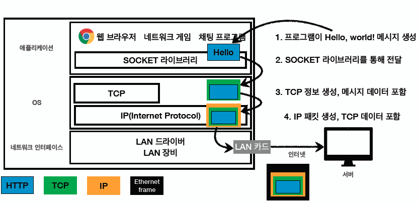
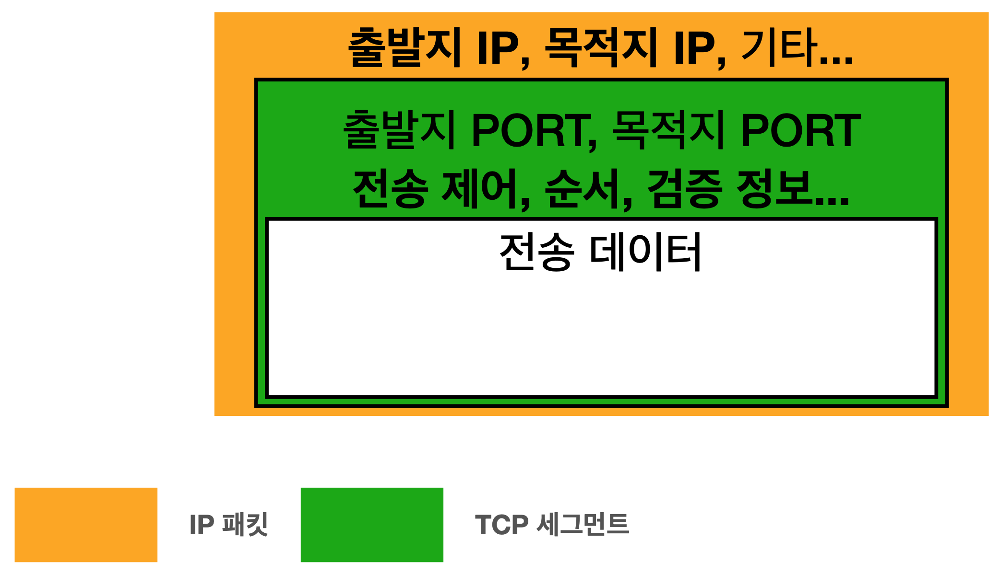

# Network

- [Network](#network)
  - [인터넷 통신](#인터넷-통신)
  - [IP(Internet Protocol)](#ipinternet-protocol)
    - [IP의 역할을 정리](#ip의-역할을-정리)
    - [IP 방식의 한계](#ip-방식의-한계)
  - [TCP(Transmission Control Protocol)](#tcptransmission-control-protocol)
    - [TCP가 IP의 한계를 어떻게 해결하는지](#tcp가-ip의-한계를-어떻게-해결하는지)
    - [TCP 특징](#tcp-특징)
    - [TCP 3 way handshake](#tcp-3-way-handshake)
    - [TCP의 데이터 전달 보증](#tcp의-데이터-전달-보증)
    - [TCP의 순서 보장](#tcp의-순서-보장)
  - [UDP(User Datagram Protocol)](#udpuser-datagram-protocol)
  - [Socket과 Port](#socket과-port)
    - [Port](#port)

 

## 인터넷 통신

네트워크 디바이스들은 어떻게 통신을 할까? 

직접 케이블을 연결해 통신할 수도 있고, 인터넷 망을 통해 통신하기도 한다.

인터넷 망을 사용한 통신은 통신에 참여하는 네트워크 디바이스들 간의 통신을 위해 광케이블, 인공위성 등을 거칠수도 있다. 그리고 수많은 중간 노드(서버)를 거쳐야 할 수도 있다. 이렇듯 어떤 것들을 거쳐간 결과 통신이 이루어지는 것이다.

통신하려는 네트워크 디바이스들 사이에 어떤 중간 노드를 거치던 원하는 네트워크 디바이스와 통신하기 위해 `IP 프로토콜`이라는 개념이 사용된다.

 

## IP(Internet Protocol)

`IP(Internet Protocol)`은 인터넷 망에 있는 네트워크 디바이스들 간 통신을 할 수 있도록 정해놓은 규약 중 하나다. IP 주소(IP Address)라는 개념을 사용하며, 패킷(Packet)이라는 통신 단위로 데이터를 전달하는 규약이다.

인터넷 망에 있는 네트워크 디바이스들은 IP 주소를 부여받는다. 따라서, 인터넷 망이 복잡하더라도 목적지를 지정할 수 있는 주소가 있기 때문에 데이터를 전달하는 것이 가능하다.

통신 메시지를 지정한 IP 주소로 전송할 때는 IP 패킷이라는 규칙에 따라 전송한다. IP 패킷은 통신의 출발지 IP, 목적지 IP와 기타 정보들을 포함한다. 이렇게 IP 패킷을 만들어 인터넷 망으로 보내면 인터넷 망에 있는 서버들도 동일하게 IP 규약을 따르고 있기 때문에 IP 패킷의 정보를 이해할 수 있는 것이다. 이 패킷 정보로 패킷이 최종 목적지에 도달할 수 있도록 서버들끼리 패킷을 주고받는다.

### IP의 역할을 정리
- 지정한 IP 주소에 데이터 전달
- 패팃이라는 통신 단위로 데이터 전달

### IP 방식의 한계
1. 비연결성
    - 패킷을 받을 대상이 없거나 서비스 불능 상태여도 패킷 전송 (ex. 목적지 서버가 꺼져있어도 전송한다)
2. 비신뢰성
    - 목적지에 도착 전 중간 서버가 문제가 상겨 중간에 패킷이 사라지면?
    - 패킷들이 서로 다른 경로로 목적지에 도착할 때 패킷이 순서대로 안오면?
3. 프로그램 구분
    - 같은 IP를 사용하는 서버에서 통신하는 애플리케이션이 둘 이상이면? 

→ IP는 위와 같은 문제들을 해결할 수 없다

이런 IP의 한계를 해결해주는 프로토콜이 TCP이다

 

## TCP(Transmission Control Protocol)

TCP는 전송 제어 프로토콜이다. 전송을 어떻게 할지 제어하는 역할을 한다.

### TCP가 IP의 한계를 어떻게 해결하는지

**인터넷 프로토콜 스택 4계층**
- 애플리케이션 계층 - HTTP, FTP, ...
- 전송 계청 - TCP, UDP
- 인터넷 계층 - IP
- 네트워크 인터페이스 계층

인터넷 프로토콜 스택은 위와 같이 구성되어 있는데, IP 계층 위에 TCP, UDP를 올려서 IP 계층을 보완해준다.

    
    
<i style="font-size : 10px;">출처 - [인프런 - 모든 개발자를 위한 HTTP 웹 기본 지식(김영한)]</i>

예를 들어,

1. 채팅 프로그램으로 미국에 있는 사용자에게 Hello, world! 메시지를 보내려고 한다
2. 채팅 프로그램은 SOCKET 라이브러리를 통해 운영체제 계층에 메시지를 전송한다
3. OS 계층에서는 메시지에 TCP 정보를 씌운다
4. OS 계층에서 TCP 밑의 IP 계층에서는 TCP 정보 밖에 IP와 관련된 정보를 씌워 IP 패킷을 생성한다 
5. IP 패킷이 네트워크 인터페이스의 LAN 카드를 통해 외부 서버로 나갈 때 Ethernet frame을 씌운다. Ethernet frame은 랜 카드에 등록된 맥 주소와 같은 물리적인 정보를 포함한다

**TCP/IP 패킷 정보**

    
    
<i style="font-size : 10px;">출처 - [인프런 - 모든 개발자를 위한 HTTP 웹 기본 지식(김영한)]</i>

IP 패킷 안에 TCP와 관련된 정보가 들어가는데 TCP 정보에 포함된 출발지 PORT, 목적지 PORT, 전송 제어, 순서, 검증 정보 등은 IP 만으로 해결되지 않았던 문제를 해결한다.

### TCP 특징
- 연결지향 - 상대방과 나를 연결하고 메시지를 보낸다 (TCP 3 way handshake (가상 연결))
- 테이터 전달 보증 - 메시지를 보냈는데 패킷이 중간에 누락되었다면 발송한 쪽에서 이를 알 수 있다
- 순서 보장

→ TCP는 신뢰할 수 있는 프로토콜이다

### TCP 3 way handshake
1. 클라이언트에서 서버로 SYN(전송 요청)이라는 메시지를 보낸다
2. 서버는 나도 연결해줘라는 SYN와 받았다는 ACK(요청 수락) 메시지를 함께 보낸다
3. 클라이언트는 받았다는 ACK를 보낸다

이렇게 하면 두 컴퓨터가 신뢰하는 연결이 된다. 연결이 되고 나면 그 다음에 데이터를 전송한다. 요즘에는 최적화가 되서 마지막 3번 ACK를 보낼 때 데이터를 같이 전송한다. 이 연결 과정은 물리적 연결이 아니라 **논리적 연결**이다. 즉, 이 연결을 위한 전용 랜선이 보장되는게 아니다.

### TCP의 데이터 전달 보증
TCP를 사용하면 클라이언트가 데이터를 전송했을 때 서버는 데이터를 잘 받았다고 클라이언트에게 데이터를 보내준다.

### TCP의 순서 보장
패킷을 1, 2, 3 순서로 전송했는데 서버에 1, 3, 2 순서로 도착했을 때 내부 최적화 로직에 따라 달라질 수 있지만 기본적으로 3번부터는 버리고 패킷 2번부터 다시 보내라는 응답을 클라이언트로 전송한다.

 

위 기능과 과정들은 모두 TCP/IP 패킷 정보에 있는 전송 제어 정보, 순서 정보, 검증 정보들이 있기 때문에 가능한 것이고, 그렇기 때문에 TCP를 신뢰할 수 있는 프로토콜이라고 하는 것이다.

 

## UDP(User Datagram Protocol)

TCP와 UDP는 IP 바로 위 같은 계층에 있다.

UDP는 기능이 거의 없다. 3 way handshake도 없고, 데이터 전달 보증도 없고, 순서 보장도 없지만 단순하고 빠르다. IP와 거의 같은데 PORT 정보, 체크섬(메시지가 제대로 왔는지 검증해주는 데이터) 정도만 추가된 것이다. TCP, UDP 패킷을 보면 동일하게 PORT가 있고, IP 패킷에는 PORT가 없다.

PORT는 하나의 컴퓨터에서 여러 애플리케이션이 실행 중일 때 IP 주소로 들어온 여러 패킷들이 어떤 애플리케이션을 위한 패킷인지를 구분하는데 사용된다.

TCP는 3 way handshake를 하는 시간이 필요하고, 데이터 보장을 위한 데이터 양이 크고, 전송 속도는 이미 구촉된 내용들이 많기 때문에 더 빠르게 최적화하고 싶을 때 변경이 어렵다. 따라서 더 최적화하고 싶을 때는 UDP를 사용한다. UDP는 구현된 기능이 적기 때문에 원하는걸 애플리케이션 레벨에서 만들어 내면 된다.

 

## Socket과 Port

> Socket이 전화기라면 Port는 전화번호

소켓을 이용하면 내부적으로 어떻게 통신하는지 정확하게 알지 못하더라도 컴퓨터끼리 네트워크상에서 데이터를 주고받을 수 있다. 소켓을 생성한다는 것은 전화기를 한 대 구입하는 것에 비유할 수 있다. 일반 전화기와의 차이점은 전화를 거는 용도의 소켓과 전화를 수신하는 용도의 소켓을 생성하는 방법에 차이가 있다는 것이다.

전화기에 전화번호가 부여되듯 소켓에는 주소 정보가 할당되는데 소켓의 주소 정보는 IP와 PORT번호로 구성된다.

### Port

 

---

 

참고

- [인프런 - 모든 개발자를 위한 HTTP 웹 기본 지식(김영한)](https://www.inflearn.com/course/http-%EC%9B%B9-%EB%84%A4%ED%8A%B8%EC%9B%8C%ED%81%AC#)
- [네트워크 프로그래밍과 소켓의 이해](https://gaussian37.github.io/c-linux-socket-01/)