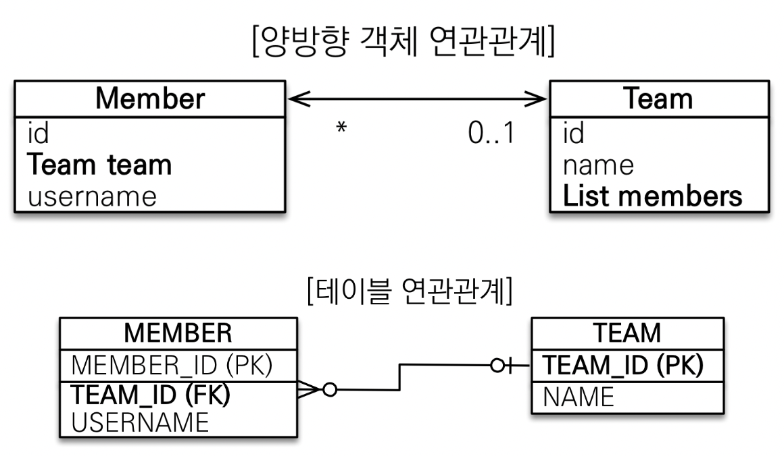

- [연관관계](#연관관계)
  - [단방향 연관관계](#단방향-연관관계)
  - [양방향 연관관계](#양방향-연관관계)
    - [연관관계 주인](#연관관계-주인)
    - [누구를 주인으로?](#누구를-주인으로?)
    - [주의점](#주의점)
    - [설계 방법](#설계-방법)

# 연관관계

## 단방향 연관관계

한쪽으로만 객체 그래프를 탐색할 수 있게 설정된 연관관계

## 양방향 연관관계
양쪽으로 객체 그래프를 탐색할 수 있는 연관관계
= 서로 다른 단방향 연관관계가 2개인 것

### 연관관계 주인

```java
class Member {
	Team team;
}

class Team {
	List<Member> members = new ArrayList<>();
}
```

<p align="center">
    
</p>

객체의 양방향 연관관계는 2개의 단방향 연관관계를 사용하지만 테이블의 연관관계는 외래 키 1개만을 사용한다. 즉, 객체는 양쪽으로 탐색하기 위해 2개의 관계를 설정하지만, 테이블은 외래 키 1개로 양쪽을 모두 찾을 수 있다.

<br/>

이 패러다임의 차이로 Member의 team을 업데이트 할 때 MEMBER 테이블의 TEAM_ID를 업데이트 할 것인지, Team의 members를 업데이트 할 때 MEMBER 테이블의 TEAM_ID를 업데이트 할 것인지 정해줘야 한다 → 연관관계 주인

<br/>

- 연관관계의 주인만이 외래 키를 관리(등록, 수정)
- 주인이 아닌쪽은 읽기만 가능
- 주인은 `mappedBy` 속성 사용 X
- 주인이 아니라면 `mappedBy` 속성으로 주인을 지정
    - `mappedBy = "company"`  → “`company` 라는 값으로 매핑이 되었어”

### 누구를 주인으로?

외래 키가 있는 곳을 주인으로
- Team을 주인으로 하면 Team을 업데이트 할 때 MEMBER에 업데이트가 나가니까 헷갈릴 수 있다

### 주의점

1. 연관관계 양쪽 객체에 모두 값을 설정하자 → 실수하지 않게 양쪽에 모두 값을 채워주는 메서드를 생성하자
    - 연관관계 주인에 값을 입력하지 않았을 때

      Member가 연관관계 주인일 때

        ```java
        team.getMembers().add(member); // 이렇게만 하면 MEMBER 테이블에 TEAM에 대한 외래 키가 insert 되지 않음
        
        member.setTeam(team); // 연관관계 주인인 member에 값을 입력해야 MEMBER 테이블에 TEAM에 대한 외래 키가 제대로 들어간다
        ```

    - 연관관계 양쪽 다 값을 입력하지 않았을 때 → 1차 캐시에서 조회 시 값이 없을 수 있다

        ```java
        Team team = new Team();
        em.persist(team);
        
        Member member = new Member();
        member.setTeam(team); // 연관관계 주인에 값을 입력
        em.persist(member);
        
        // team.getMembers().add(member) <- 연관관계 주인이 아닌 쪽에는 값을 입력하지 않은 상태에서
        
        // em.flush(); <- 여기에서 flush()가 됐다면 MEMBER 테이블에 TEAM_ID가 들어갔을텐데
        
        Team findTeam = em.find(Team.class, team.getId()); // 1차 캐시에서 조회
        List<Member> members = findTeam.getMembers(); // Member도 Team도 flush()가 안된 상태에서, 1차 캐시에서 조회된 team에는 아직 members가 없음
        ```

    - JPA 없이 테스트 케이스를 작성할 때도 값이 없으면 테스트가 어려움
2. 무한 루프를 조심하자
   ex) toString(), Lombok, JSON 생성 라이브러리


### 설계 방법

- N → 1 쪽으로의 단방향 매핑만으로도 연관관계 매핑은 완료된 것이다
- 그리고 나서 양방향 매핑을 필요할 때 추가 (JPQL에서 역방향으로 탐색할 일이 많음)

<br/>

--- 

<br/>

참고 및 출처
- [자바 ORM 표준 JPA 프로그래밍 - 기본편](https://www.inflearn.com/course/ORM-JPA-Basic/dashboard)