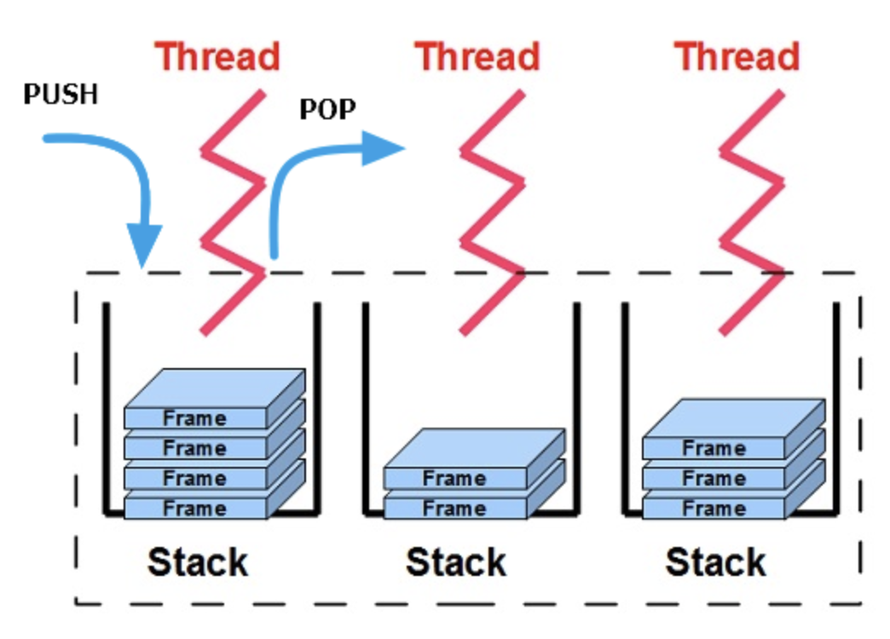

# JVM (Java Virtual Machine)

Java를 실행하기 위한 가상 머신[( Virtual Machine )](../etc/virtual_machine.md). 즉, 컴퓨터에서 Java를 실행하기 위해 소프트웨어로 구현된 가상의 하드웨어로 컴퓨터와 거의 동일한 기능을 수행할 수 있는 컴퓨터의 가상화된 인스턴스이다.

Java로 작성된 애플리케이션은 모두 이 가상 컴퓨터(JVM)에서만 실행되기 때문에 Java 애플리케이션이 실행되기 위해서는 반드시 JVM이 필요하다.

 

    

 

Java 애플리케이션은 JVM을 거쳐 OS → 하드웨어로 전달된다. 만약, Java 애플리케이션과 OS 사이에 JVM이 없다면 다른 OS에서 Java 애플리케이션을 실행시키기 위해서는 애플리케이션을 그 OS에 맞게 변경해야한다. 하지만 Java 애플리케이션은 JVM 하고만 상호작용을 하면 된다. 다른 OS에서 Java 애플리케이션을 실행시키려면 해당 OS에서 실행가능한 JVM만 있으면 된다. 즉, 특정 OS용 JVM만 있다면 Java 애플리케이션은 OS와 하드웨어에 독립적으로 존재할 수 있는것이다.

 

## JVM 실행

    

 

java.exe 명령어가 실행되면서 JVM은 [바이트코드](../etc/binary_code_&_bytecode.md) 파일(Hello.class)을 메모리로 로드 → **해당 운영체제에 맞게 기계어로 번역** → `main()` 메서드를 찾아 실행

 

## JVM 구성 요소

    

JVM은 크게 
- 클래스 로더 (Class Loader), 
- 런타임 데이터 영역 (Runtime Data Area), 
- 실행 엔진 (Execution Engine)
- 자바 네이티브 인터페이스 (Java Native Interface, JNI)
로 구성되어 있다.

클래스 로더는 컴파일된 자바 바이트코드를 런타임 데이터 영역에 로드하고, 실행 엔진은 바이트코드를 실행한다.

### 클래스 로더(Class Loader)

java.exe 명령어가 실행되어 JVM이 구동되면 클래스 로더는 시작 클래스의 바이트코드 파일(.class)을 런타임 데이터 영역(JVM이 운영체제로부터 할당받은 메모리 영역(RAM))으로 적재(Loading)하는 일을 한다.

이 때 `main()`를 찾아 `main()`부터 메모리에 적재되는데, `main()`이 실행되면서 필요한 객체들을 동적으로 로드한다. 컴파일 타임이 아니라 자바 애플리케이션이 실행되는 시점에 클래스가 처음으로 참조될 때 해당 클래스를 로드한다(동적 클래스 로딩, Dynamic class loading). 이렇게 로드된 객체들이 인터프리트 된다.

클래스 로더는 메모리 영역에 코드를 Loading하는 역할과 클래스 파일의 에러를 검증하고 레퍼런스들을 연결하는 Linking 작업, 초기화(Initialization)까지 수행한다.

#### Loading (적재)
Loading 작업은 보통 `static main()` 메서드부터 시작된다.

#### Linking (연결)
로드된 클래스나 인터페이스를 검증(verify)하고 준비(prepare)하는 과정이다. 
- Verification(검증)
  서로 상호작용하는 클래스들을 연결할 때 바이트코드를 실행 가능한 바이너리 코드로 만들어 주고(linking), 잘 변환이 됐는지 검증한다.
- Preparation(준비)
  데이터 구조나 static 공간을 위해 메모리를 할당하고, static field는 기본 값으로 생성, 초기화된다.
- Resolution(실행)
  참조 관계를 참조 대상의 이름으로 참조하는 것이 아니라 실제 객체의 주소를 참조하도록 한다. 이는 메모리에 할당된 실제 주소를 코드에 반영하고, 실행 가능한 바이너리코드가 되는 것이다.

#### Initialize (초기화)
클래스나 인터페이스의 초기화 로직이 실행된다(생성자). 이는 링크 단계에서 기본 값으로 초기화된 Static 변수들을 프로그래머가 입력한 값으로 정의해준다. 

### 런타임 데이터 영역(Runtime Data Area)
JVM이 프로그램을 실행하기 위해 운영체제로부터 할당받은 메모리 영역이다.

#### Method Area
- JVM 내 스레드들이 공유하는 자원
- 클래스에서 필요한 패키지 클래스, 런타임 상수풀, 인터페이스, 상수, static 변수, final 변수, 필드 데이터, 생성자 등 모든 메서드 정보가 적재된 후 항상 상주하는 영역
  - 이 영역 덕분에 `Math.abs(-10)`과 같이 `Math` 클래스의 메서드를 초기화 없이 바로 사용할 수 있다

#### Heap

- 객체들을 위한 영역으로 `new`를 통해 생성된 객체, 배열, immutable 객체 등의 값이 저장된다
- Stack Area의 변수나 다른 객체의 필드에서 참조할 수 있다
- 객체를 참조하는 곳이 없을 때 Garbage Collector에 의해 이 영역에서 제거된다

#### Stack Area
- 스레드마다 하나씩 존재, 스레드가 시작될 때 할당된다
- 메소드에서 사용할 지역 변수, 파라미터, 리턴 값, 참조 변수일 경우 주소 값들이 저장된다
- 메소드가 호출되면 스택에 push되고, 메소드가 종료되면 pop 된다

    

#### PC Register
- 스레드마다 하나씩 존재, 스레드가 시작될 때 할당된다
- 현재 스레드가 실행되는 부분의 주소와 명령을 저장하고 있다
- 이 영역을 이용해 다수의 스레드들이 명령의 흐름을 잃지 않고 함수가 순차적으로 실행된다

#### Native Method Stack
- 자바 외 다른 언어로 작성된 네이티브 코드를 수행하기 위한 메모리 영역
- 다른 언어에서 제공되는 Method 정보가 저장

 

JVM이 실행되면 → 힙, 메서드 영역이 생성되고 → JVM의 클래스 로더는 시작 클래스로 지정된 .class 파일을 메서드 영역으로 로딩한다(이 과정을 시작 클래스를 생성한다라고 할 수 있다) → 시작 클래스가 생성되면 런타임 상수 풀도 함께 생성된다  

 

--- 

 

출처 및 참고

- Effective Java - 조슈아 블로크 
- Java의 정석 (남궁 성)
- [우아한테크코스 테코톡 - 던의 JVM의 Garbage Collector](https://www.youtube.com/watch?v=vZRmCbl871I&list=PLgXGHBqgT2TvpJ_p9L_yZKPifgdBOzdVH&index=64)
- [#자바가상머신, JVM(Java Virtual Machine)이란 무엇인가?](https://asfirstalways.tistory.com/158)
- [[Java] JDK, JVM 용어 정리 및 프로그램 실행 단계](https://you9010.tistory.com/150)
- [JVM, JRE, JDK의 차이](https://wikidocs.net/257)
- [JVM(Java Virtual Machine), 바이트코드(Byte Code)](https://beststar-1.tistory.com/2)
- [Back to the Essence - Java 컴파일에서 실행까지 - (2)](https://homoefficio.github.io/2019/01/31/Back-to-the-Essence-Java-%EC%BB%B4%ED%8C%8C%EC%9D%BC%EC%97%90%EC%84%9C-%EC%8B%A4%ED%96%89%EA%B9%8C%EC%A7%80-2/)
- [JVM( Java Virtual Machine )이란](https://honbabzone.com/java/java-jvm/)
- [[Java]JVM Architecture란?](https://yeon-kr.tistory.com/112)