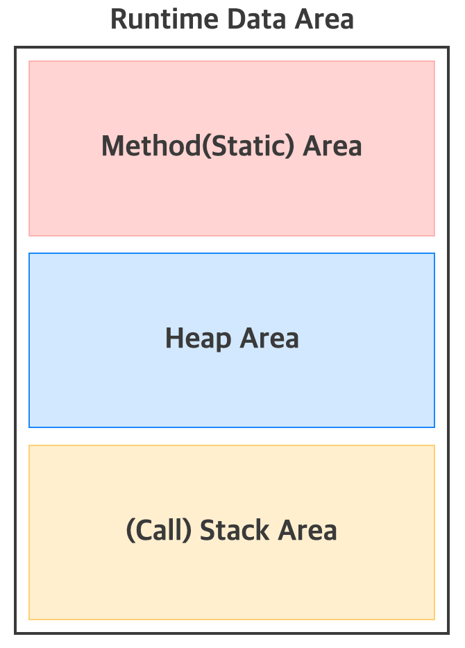

# JVM (Java virtual machine)

Java를 실행하기 위한 가상 머신. 즉, 컴퓨터에서 Java를 실행하기 위해 소프트웨어로 구현된 가상의 하드웨어로 컴퓨터와 거의 동일한 기능을 수행할 수 있는 컴퓨터의 가상화된 인스턴스이다. [( Virtual Machine )](../etc/virtual_machine.md)

Java로 작성된 애플리케이션은 모두 이 가상 컴퓨터(JVM)에서만 실행되기 때문에 Java 애플리케이션이 실행되기 위해서는 반드시 JVM이 필요하다.

 

    

 

Java 애플리케이션은 JVM을 거쳐 OS → 하드웨어로 전달된다. 만약, Java 애플리케이션과 OS 사이에 JVM이 없다면 다른 OS에서 Java 애플리케이션을 실행시키기 위해서는 애플리케이션을 그 OS에 맞게 변경해야한다. 하지만 Java 애플리케이션은 JVM 하고만 상호작용을 하면 된다. 다른 OS에서 Java 애플리케이션을 실행시키려면 해당 OS에서 실행가능한 JVM만 있으면 된다. 즉, 특정 OS용 JVM만 있다면 Java 애플리케이션은 OS와 하드웨어에 독립적으로 존재할 수 있는것이다.

 

## JVM 구동

    

 

java.exe 명령어가 실행되면서 JVM은 바이트 코드 파일(Hello.class)을 메모리로 로드 → 해당 운영체제에 맞게 기계어로 번역 → `main()` 메서드를 찾아 실행

 

## JVM의 메모리 구조

java.exe로 JVM이 시작되면 JVM은 운영체제로부터 프로그램을 수행하는데 필요한 메모리영역(Runtime Data Area)을 할당받고, 이 메모리를 여러 영역으로 나누어 관리한다

    

### Method(Static) Area
- 모든 스레드가 공유하는 영역
- 클래스에 대한 정보

### Stack Area
- 스레드 마다 자신의 스택 영역을 가진다
- 메서드가 호출되면 메서드를 위한 메모리가 할당되며, 이 메모리에는 메서드의 지역변수, 중간 결과 등을 저장하는데 사용되고, 메서드가 작업을 마치면 반환된다.
- 인스턴스에 대한 참조값이 저장되며, 인스턴스는 Heap Area에 생성된다.

### Heap Area
- 모든 스레드가 공유하는 영역

 

## JVM 역할
- 바이너리 코드를 읽는다
- 바이너리 코드를 검증한다 
  예를 들어, 
  - JVM은 배열에 접근할 때마다 경계를 넘지 않는지 검사한다
- 바이너리 코드를 실행한다
- 실행환경(Runtime Environment)의 규격을 제공한다(필요한 라이브러리 및 기타 파일)

 
- 운영체제의 메모리 영역에 접근하여 메모리를 관리하는 프로그램

 

--- 

 

출처

- Effective Java - 조슈아 블로크 
- Java의 정석 (남궁 성)
- [우아한테크코스 테코톡 - 던의 JVM의 Garbage Collector](https://www.youtube.com/watch?v=vZRmCbl871I&list=PLgXGHBqgT2TvpJ_p9L_yZKPifgdBOzdVH&index=64)
- [#자바가상머신, JVM(Java Virtual Machine)이란 무엇인가?](https://asfirstalways.tistory.com/158)
- [[Java] JDK, JVM 용어 정리 및 프로그램 실행 단계](https://you9010.tistory.com/150)
- [JVM, JRE, JDK의 차이](https://wikidocs.net/257)
- [JVM(Java Virtual Machine), 바이트코드(Byte Code)](https://beststar-1.tistory.com/2)