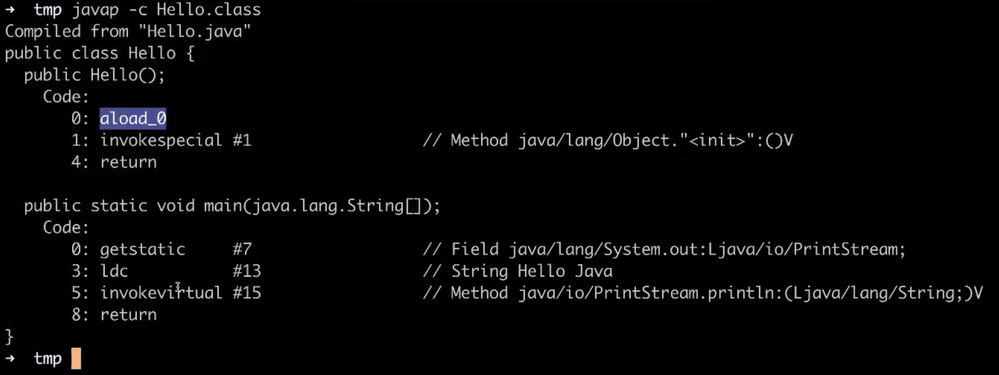

# 바이트코드

[바이트코드](https://github.com/ddalam/ddalam-wiki/blob/master/etc/binary_code_&_bytecode.md#%EB%B0%94%EC%9D%B4%ED%8A%B8%EC%BD%94%EB%93%9Cbytecode)

    

- `getstatic`과 같은 opcode가 한 바이트이다
- JVM이 이해할 수 있는 바이트코드만 만들 수 있다면 꼭 Java를 사용하지 않아도 된다. 코틀린, 그루비, 스칼라 등