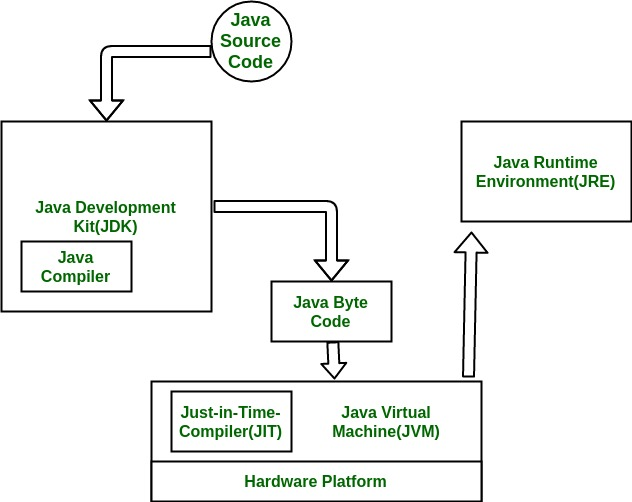
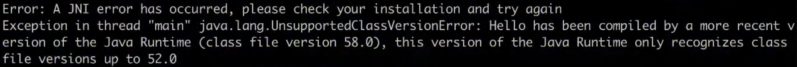

# Java 코드 컴파일 및 실행

<p align="center">
    
</p>

1. Java 코드를 작성
2. JDK의 Java Compiler로 .java 파일 [컴파일](https://github.com/ddalam/ddalam-wiki/blob/master/Java/JVM.md#jvm-java-virtual-machine)하기 (JVM이 해석할 수 있는 bytecode로)
   ```bash
   $ javac Hello.java
   ```
3. 2번 과정으로 생성된 **Java Bytecode**를 JVM에서 하드웨어에 맞는 기계어로 변환
4. Java 애플리케이션 실행
   ```bash
   $ java Hello
   ```

<br/>

- Java 컴파일러 : `javac`
- 상위 버전의 Java로 컴파일된 바이트코드는 하위 버전의 자바로 실행할 수 없다(반대는 가능하다)
  - `UnsupportedClassVersionError` 가 발생한다
   <p align="center">
      
   </p>
- 컴파일 할 때 옵션(`source`, `target`)을 주면 하위 버전의 자바로도 실행할 수 있다

<br/>

---

<br/>

참고
- [Differences between JDK, JRE and JVM](https://www.geeksforgeeks.org/differences-jdk-jre-jvm/)
- [Live Study 1주차 - JVM은 무엇이며 자바 코드는 어떻게 실행하는 것인가](https://youngjinmo.github.io/2021/01/livestudy-week-01/#bytecode)