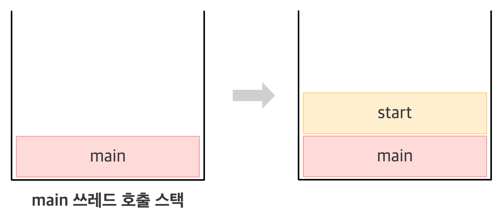
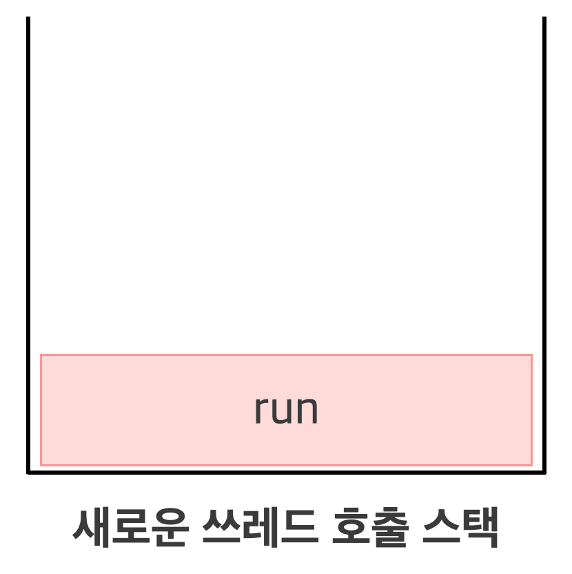

- [쓰레드](#쓰레드)
  - [쓰레드 구현 방법](#쓰레드-구현-방법)
    - [`Thread` 클래스를 상속받는 방법](#thread-클래스를-상속받는-방법)
    - [`Runnable` 인터페이스를 구현](#runnable-인터페이스를-구현)
    - [쓰레드 실행 - `start()`](#쓰레드-실행---start)
  - [쓰레드와 메모리](#쓰레드와-메모리)

<br/>

# 쓰레드

## 쓰레드 구현 방법
`Thread` 클래스를 상속받는 방법, `Runnable` 인터페이스를 구현하는 방법이 있다

어느 쪽을 선택해도 별 차이는 없지만 Thread 클래스를 상속받으면 다른 클래스를 상속받을 수 없기 때문에, Runnable 인터페이스를 구현하는 방법이 **일반적**이다.

쓰레드를 구현한다는 것은 어떤 방법을 선택하든지, 그저 쓰레드를 통해 작업하고자 하는 내용으로 `run()` 메서드의 내용을 채우는 것일 뿐이다.

<br/>

### `Thread` 클래스를 상속받는 방법
```java
class MyThread extends Thread {
    // Thread 클래스의 run()을 오버라이딩
    public void run() { /* 작업 내용 */ }
}
```

**쓰레드 인스턴스 생성**

```java
Thread thread = new Thread(new MyThread());
```

<br/>

### `Runnable` 인터페이스를 구현
```java
class MyThread implements Runnable {
    // Runnable 인터페이스의 run()을 구현
    public void run() { /* 작업 내용 */ }
}
```

**쓰레드 인스턴스 생성**

```java
Runnable runnable = new MyThread();
Thread thread = new Thread(runnable);
```

Runnable 인터페이스를 구현한 경우, Runnable 인터페이스를 구현한 클래스의 인스턴스를 Thread 클래스의 생성자 매개변수로 제공해야 한다.
```java
// Thread 클래스
public class Thread {
    private Runnable r;

    public Thread(Runnable r) {
        this.r = r;
    }

    ...
}
```

<br/>

### 쓰레드 실행 - `start()`

`start()`를 호출해야 쓰레드가 실행된다. 호출되었다고 해서 바로 실행되는 것은 아니고, 일단 실행대기 상테에 있다가 자신의 차례가 되어야 실행된다.
쓰레드의 실행순서는 OS의 스케줄러가 작성한 스케줄에 의해 결정된다.

하나의 쓰레드에 대해 `start()`는 한 번만 호출될 수 있다. 쓰레드의 작업을 한 번 더 수행해야 한다면 새로운 쓰레드를 생성한 다음 실행해야 한다. 만약 두 번 이상 호출하면 `IllegalThreadStateException`이 발생한다.

`run()`은 단순히 클래스에 선언된 메서드를 호출하는 것이고, `start()`는 새로운 쓰레드가 작업하는데 필요한 호출 스택을 생성한 다음 `run()`을 호출해서 생성된 호출 스택에 `run()`이 첫 번째로 올라가게 한다.

<br/>

## 쓰레드와 메모리

자바 프로그램을 실행하면 main쓰레드를 위한 호출스택이 생성되고, main 메서드가 처음으로 호출된다. 그리고 실행 중인 사용자 쓰레드(user thread)가 하나도 없을 때 프로그램이 종료된다.

<p align="center">
    
</p>

<p align="center">
    
</p>

1. main 메서드에서 쓰레드의 `start()`를 호출한다.
2. `start()`는 새로운 쓰레드를 생성하고, 쓰레드가 작업하는데 사용될 호출 스택을 생성한다.
3. `start()`는 `run()`을 호출해서 생성된 호출 스택에 `run()`이 올라가게 되고, 호출된 `run()`을 통해 새로운 쓰레드는 독립된 공간에서 작업을 수행한다.
4. 스케줄러가 정한 순서에 의해 호출 스택들이 번갈아 가며 실행된다.

<br/>

---

<br/>

출처 
- Java의 정석(남궁 성)