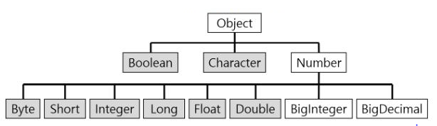

- [Wrapper 클래스](#wrapper-클래스)
  - [Number 클래스](#number-클래스)
  - [문자열을 숫자로 변환하기](#문자열을-숫자로-변환하기)
  - [autoboxing, unboxing](#autoboxing-unboxing)

# Wrapper 클래스

8개의 기본형(primitive type)을 객체로 다룰 수 있도록 해주는 클래스

- 모두 `equals()`가 오버라이딩되어 있어서 주소값이 아닌 객체가 가지고 있는 값을 비교한다
    ```java
  public boolean equals(Object obj) {
        if (obj instanceof Integer) {
            return value == ((Integer)obj).intValue();
        }
        return false;
    }
  ```
- `toString()`도 오버라이딩되어 있다
- `compareTo()`를 제공한다
- `MIN_VALUE`, `MAX_VALUE`, `TYPE` 등의 static 상수를 가지고 있다

<br/>

## `Number` 클래스

<p align="center">
    
    <p align="center"><a href="https://velog.io/@leeconomy1121/JAVA-day-10">JAVA day 10</a></p>
</p>

- 숫자와 관련된 Wrapper 클래스들은 `Number` 클래스를 상속 받는다
- 객체가 가지고 있는 값을 기본형으로 변환하여 반환하는 메서드들을 정의하고 있다
- `BigInteger` : long으로도 다룰 수 없는 큰 범위의 정수를 처리
- `BigDecimal` : double로도 다룰 수 없는 큰 범위의 부동 소수점수를 처리

## 문자열을 숫자로 변환하기

### 문자열을 기본형으로 변환하기
`타입.parse타입(String s)`

ex) `int i = Integer.parseInt("100)"`

### 문자열을 Wrapper 클래스로 변환하기
`타입.valueOf(String s)`

ex) `Integer i = Integer.valueOf("100")`

<br/>

- 오토박싱 기능으로 반환값이 기본형일 때와 Wrapper 클래스일 때의 차이가 없어졌다. 구별없이 사용해도 되며, 성능은 `valueOf()`가 조금 더 느리다
- 문자열을 10진법이 아닌 다른 진법의 숫자일 때도 10진법으로 변환해주는 메서드도 제공된다

## autoboxing, unboxing


<br/>

---

<br/>

참고 및 출처
- Java의 정석(남궁 성)
