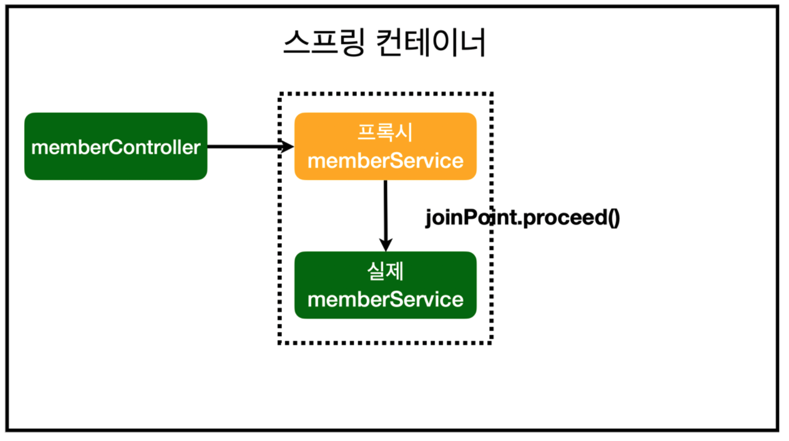

- [AOP(Aspect Oriendted Programming)](#aopaspect-oriendted-programming)
  - [AOP가 필요한 상황](#aop가-필요한-상황)
    - [애플리케이션 로직은 크게 핵심 기능과 부가 기능으로 나눌 수 있다](#애플리케이션-로직은-크게-핵심-기능과-부가-기능으로-나눌-수-있다)
    - [핵심 기능과 부가 기능을 분리하지 않으면?](#핵심-기능과-부가-기능을-분리하지-않으면)
  - [AOP란?](#aop란)
  - [AOP 프레임워크](#aop-프레임워크)
  - [AOP를 사용할 때 부가 기능 로직을 어떤 방식으로 핵심 기능 로직에 추가할 수 있을까?](#aop를-사용할-때-부가-기능-로직을-어떤-방식으로-핵심-기능-로직에-추가할-수-있을까)
    - [컴파일 시점](#컴파일-시점)
    - [클래스 로딩 시점](#클래스-로딩-시점)
    - [런타임 시점(프록시)](#런타임-시점프록시)
  - [AOP 적용 위치](#aop-적용-위치)
  - [Spring AOP](#spring-aop)
  - [AOP를 적용했을 때 의존관계](#aop를-적용했을-때-의존관계)
  - [`@Aspect`](#aspect)
  - [포인트컷](#포인트컷)
  - [조인 포인트](#조인-포인트)

# AOP(Aspect Oriendted Programming)

## AOP가 필요한 상황

### 애플리케이션 로직은 크게 핵심 기능과 부가 기능으로 나눌 수 있다
- 핵심 기능은 해당 객체가 제공하는 고유의 기능이다. 예를 들어 `OrderService` 의 핵심 기능은 주문 로직이다
- 부가 기능은 핵심 기능을 보조하기 위해 제공되는 기능이다. 예를 들어서 로그 추적 로직, 트랜잭션 기능이 있다. 이러한 부가 기능은 단독으로 사용되지 않고, 핵심 기능과 함께 사용된다. 예를 들어서 로그 추적 기능은 어떤 핵심 기능이 호출되었는지 로그를 남기기 위해 사용한다
- 보통 부가 기능은 여러 클래스에 걸쳐서 함께 사용된다. 이러한 부가 기능은 횡단 관심사(cross-cutting concern)가 된다. 하나의 부가 기능이 여러 곳에 동일하게 사용된다는 뜻이다

### 핵심 기능과 부가 기능을 분리하지 않으면?
- 부가 기능을 여러 곳에 적용하려면 너무 번거롭다. 예를 들어 부가 기능을 적용해야 하는 클래스가 100개면 100개 모두 동일한 코드를 추가해야 한다
- 핵심 비즈니스 로직에 횡단 관심 사항에 대한 로직이 섞여 유지보수가 어렵다
  - 부가 기능을 별도의 유틸리티 클래스로 만든다고 해도, 해당 유틸리티 클래스를 호출하는 코드가 결국 필요하다. 그리고 부가 기능이 `try~catch~finally` 같은 구조가 필요하다면 더욱 복잡해진다
- 횡단 관심 사항에 대한 로직을 변경할 때 모든 로직을 찾아가며 변경해야 한다
  - 부가 기능에 수정이 발생하면, 100개의 클래스를 모두 수정해야 한다
  - 부가 기능을 모든 컨트롤러에 적용했다가 서비스 계층에만 적용해야 한다는 수정이 발생하면 수 많은 코드를 고쳐야 할 것이다
- 정리하면,
  - 부가 기능을 적용할 때 많은 반복이 필요하다
  - 부가 기능이 여러 곳에 퍼져서 중복 코드를 만들어낸다
  - 부가 기능을 변경할 때 중복 때문에 많은 수정이 필요하다
  - 부가 기능의 적용 대상을 변경할 때 많은 수정이 필요하다
- 소프트웨어 개발에서 변경 지점은 하나가 될 수 있도록 잘 모듈화 되어야 한다. 그런데 **부가 기능처럼 특정 로직을 애플리케이션 전반에 적용하는 문제는 일반적인 OOP 방식으로는 해결이 어렵다**

 

**핵심 관심 사항(core concern)이 아닌 횡단(공통) 관심 사항(cross-cutting concern)을 처리해야 할 때 필요하다**

## AOP란?
- 관점 지향 프로그래밍 Aspect Oriented Programming
- 애플리케이션을 바라보는 관점을 하나하나의 기능에서 횡단 관심사 관점으로 달리 보는 것이다
- 부가 기능을 핵심 기능에서 분리해 한 곳에서 관리하도록 하고, 해당 부가 기능을 어디에 적용할 지 선택할 수 있도록 모듈을 만들었다
- 부가 기능과 해당 부가 기능을 어디에 적용할지 정의한 것을 Aspect라고 한다
- Aspect를 사용한 프로그래밍 방식을 관점 지향 프로그래밍이라고 한다
- AOP는 OOP를 대체하기 위한 것이 아니라 횡단 관심사를 깔끔하게 처리하기 어려운 OOP의 부족한 부분을 보조하는 목적으로 개발되었다

## AOP 프레임워크
- AOP의 대표적인 구현으로 AspectJ 프레임워크가 있다
  - AspectJ 프레임워크는 스스로를 다음과 같이 설명한다
    - 자바 프로그래밍 언어에 대한 완벽한 관점 지향 확장
    - 횡단 관심사의 깔끔한 모듈화
      - 오류 검사 및 처리
      - 동기화
      - 성능 최적화(캐싱)
      - 모니터링 및 로깅
- 스프링도 AOP를 구현하지만 대부분 AspectJ의 문법을 차용하고, AspectJ가 제공하는 기능의 일부만 제공한다

## AOP를 사용할 때 부가 기능 로직을 어떤 방식으로 핵심 기능 로직에 추가할 수 있을까?

### 컴파일 시점
- `.java` 를 컴파일러를 사용해서 `.class` 를 만드는 시점에 부가 기능 로직을 추가
- AspectJ가 제공하는 특별한 컴파일러를 사용해야 한다
- 원본 로직에 부가 기능 로직이 추가되는 것을 위빙(Weaving)이라 한다
- 단점
  - 특별한 컴파일러가 필요하다

### 클래스 로딩 시점
- JVM 내부의 클래스 로더가 컴파일된 바이트코드를 조작해서 부가 기능 로직을 추가
- 이 시점에 Aspect를 적용하는 것을 로드 타임 위빙이라 한다
- 단점
  - Java를 실행할 때 특별한 옵션(`java -javaagent`)을 통해 클래스 로더 조작기(AspectJ)를 지정해야 하는데 이 부분이 번거롭고 운영하기 어렵다

### 런타임 시점(프록시)
- Java가 실행되고 난 다음을 말한다(`main()` 가 실행된 다음)
- 따라서 Java 언어가 제공하는 범위 안에서 부가 기능 로직을 추가해야 한다 → 그러려면 Spring과 같은 컨테이너의 도움을 받고, 프록시와 DI, 빈 포스트 프로세서 같은 개념들을 적용해야 한다 → 이렇게 하면 최종적으로 프록시를 통해 Spring 빈에 부가 기능을 추가할 수 있다
- 특별한 컴파일러나 Java를 실행할 때 옵션을 설정하지 않아도 된다
- Spring AOP는 이 방식을 사용한다
- 단점
  - 프록시를 사용하기 때문에 AOP 기능에 일부 제약이 있다

## AOP 적용 위치
- AspectJ를 사용해서 컴파일 시점과 클래스 로딩 시점에 적용하는 AOP는 바이트코드를 실제 조작하기 때문에 부가 기능을 모든 지점에 다 적용할 수 있따
- 프록시 방식을 사용하는 스프링 AOP는 메서드 실행 지점에만 AOP를 적용할 수 있다
  - 프록시는 메서드 오버라이딩 개념으로 동작하기 때문에 생성자나 static 메서드, 필드 값 접근에는 프록시 개념이 적용될 수 없다
- 프록시 방식을 사용하는 스프링 AOP는 스프링 빈에만 AOP를 적용할 수 있다

## Spring AOP
- 스프링은 AspectJ의 문법을 차용하고 프록시 방식의 AOP를 적용한다
- AspectJ를 직접 사용하는 것이 아니다

## AOP를 적용했을 때 의존관계

    

## `@Aspect`
- AOP를 가능하게 하는 AspectJ 프로젝트에서 제공하는 애노테이션
- 스프링은 이것을 차용해서 프록시를 통한 AOP를 가능하게 한다
- 이 애노테이션을 사용하면 직접 AOP를 위한 프록시를 만들지 않아도 되도록 스프링이 편리하게 프록시를 만들어준다

## 포인트컷
- 표현식은 AspectJ 표현식을 사용한다

## 조인 포인트
- 실제 호출 대상, 전달 인자, 어떤 개체와 어떤 메서드가 호출되었는지에 대한 정보가 포함되어 있다