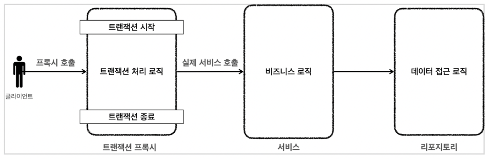
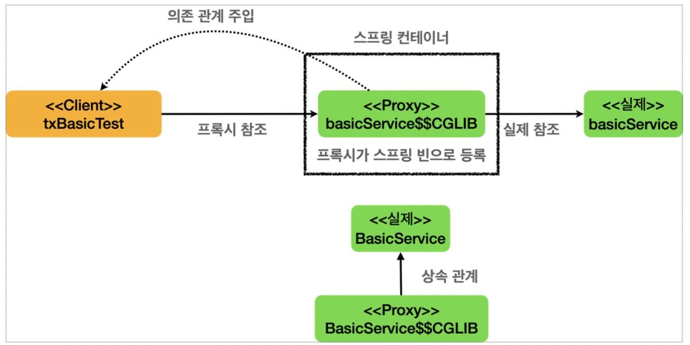

- [선언적-트랜잭션](#선언적-트랜잭션)
  - [트랜잭션 AOP](#트랜잭션-aop)

# 선언적 트랜잭션
`@Transactional` 을 통한 선언적 트랜잭션 관리 방식을 사용하게 되면 기본적으로 프록시 방식의 AOP가 적용된다

프록시를 사용하지 않으면 → 서비스 계층의 비즈니스 로직에서 트랜잭션을 직접 시작해야 된다

```java
//트랜잭션 시작
TransactionStatus status = transactionManager.getTransaction(new DefaultTransactionDefinition());

try {
	//비즈니스 로직
	bizLogic(fromId, toId, money); transactionManager.commit(status); //성공시 커밋
} catch (Exception e) { 
	transactionManager.rollback(status); //실패시 롤백
  throw new IllegalStateException(e);
}
```

프록시를 사용하면 → 트랜잭션을 처리하는 객체와 비즈니스 로직을 처리하는 서비스 객체를 명확하게 분리할 수 있다

<p align="center">
    
</p>

트랜잭션 프록시가 트랜잭션을 시작한 후에 서비스를 대신 호출한다. 트랜잭션 프록시 덕분에 서비스 계층에는 순수한 비즈니스 로직만 남길 수 있다

## 트랜잭션 AOP

<p align="center">
    
</p>

선언적 트랜잭션 방식에서 Spring 트랜잭션은 AOP를 기반으로 동작한다. `@Transactional` 이 붙은 메서드나 클래스는 트랜잭션 AOP 적용의 대상이 되고, **실제 객체 대신 트랜잭션을 처리해주는 프록시 객체가 빈으로 등록된다**. 주입을 받을 때도 실제 객체 대신 프록시 객체가 주입된다. 프록시는 대상 클래스를 상속해서 만들어지기 때문에 다형성을 활용할 수 있다. 그렇기 때문에 대상 객체 대신에 프록시 객체를 주입할 수 있다.

클래스 이름을 출력해보면 `basicService$$EnhancerBySpringCGLIB...` 라고 프록시 클래스의 이름이 출력되는 것을 확인할 수 있다.

### `@Transactional` 이 적용된 메서드 처리 순서

1. 클라이언트가 메서드를 호출하면 프록시의 메서드가 호출된다
2. 프록시는 호출된 메서드가 트랜잭션을 사용할 수 있는지 확인해본다
3. `@Transactional` 이 적용되어 있는 메서드이므로 트랜잭션 적용 대상이다
4. 트랜잭션을 시작한 다음 실제 대상 객체의 메서드를 호출한다
5. 실제 대상 객체의 메서드 호출이 끝나서 프록시로 제어가 돌아오면 프록시는 트랜잭션 로직을 커밋하거나 롤백해서 트랜잭션을 종료한다

### `@Transactional` 이 적용되지 않은 메서드 처리 순서

1. 클라이언트가 메서드를 호출하면 프록시의 메서드가 호출된다
2. 프록시는 호출된 메서드가 트랜잭션을 사용할 수 있는지 확인해본다
3. `@Transactional` 이 적용되어 있는 않은 메서드이므로 트랜잭션 적용 대상이 아니다
4. 트랜잭션을 시작하지 않고 실제 대상 객체의 메서드를 호출하고 종료한다

### 트랜잭션 AOP 프록시 객체인지 확인하는 방법

```java
AopUtils.isAopProxy(basicService))
```

true인지 false인지 확인할 수 있다

### 트랜잭션 프록시가 호출하는 트랜잭션의 시작과 종료 로그 확인

```yaml
logging.level.org.springframework.transaction.interceptor=TRACE
```

<br/>

---

<br/>

출처 및 참고
- [스프링 DB 2편 - 데이터 접근 활용 기술(김영한)](https://www.inflearn.com/course/%EC%8A%A4%ED%94%84%EB%A7%81-db-2/dashboard)