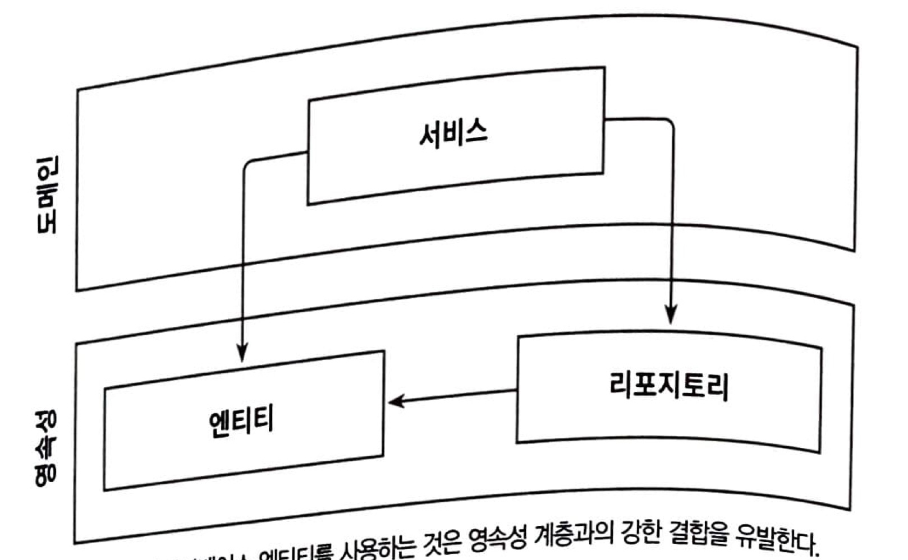
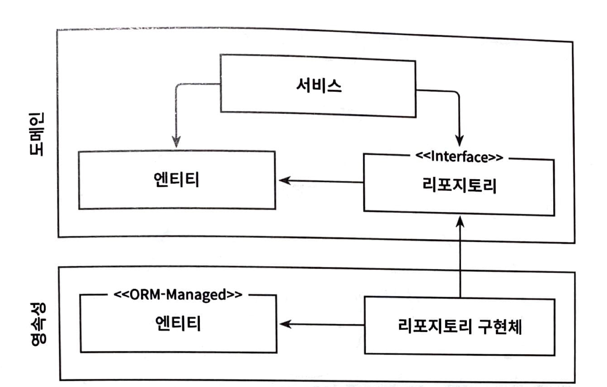
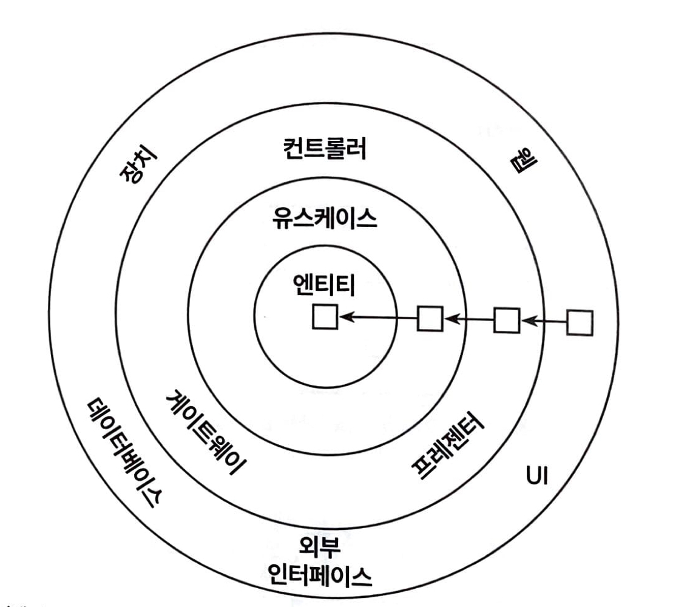

- [Hexagonal Architecture](#hexagonal-architecture)
  - [의존성 역전 원칙(Dependency Inversion Principle, DIP)](#의존성-역전-원칙dependency-inversion-principle-dip)
  - [클린 아키텍처](#클린-아키텍처)
  - [헥사고날 아키텍처(육각형 아키텍처)](#헥사고날-아키텍처육각형-아키텍처)

# Hexagonal Architecture

## 의존성 역전 원칙(Dependency Inversion Principle, DIP)

의존성 양쪽 코드를 모두 제어할 수 있을 때 어떤 의존성이든 그 방향을 바꿀 수 있다

 

계층형 아키텍처에서 계층 간 의존성은 항상 다음 계층인 아래 방향을 가리킨다. 그러므로 영속성 계층에 대한 도메인 계층의 의존성 때문에 영속성 계층을 변경할 때마다 잠재적으로 도메인 계층도 변경해야 한다. 그러나 도메인 코드는 애플리케이션에서 가장 중요한 코드다. 영속성 코드가 바뀐다고 해서 도메인 코드까지 바뀌지 않게 하려면 ? → 의존성을 제거해야 한다 → 어떻게 제거할 수 있을까? → **의존성 역전 원칙**

    

도메인 계층에서 데이터베이스 엔티티를 사용하는 것은 영속성 계층과의 강한 결합을 유발한다

    

도메인 계층에 인터페이스를 도입함으로써 의존성을 역전시킬 수 있고, 그 덕분에 영속성 계층이 도메인 계층에 의존하게 된다

엔티티는 도메인 객체를 표현하고 도메인 코드는 이 엔티티들의 상태를 변경하는 일을 중심으로 하기 때문에 먼저 엔티티를 도메인 계층으로 올린다. 이제는 영속성 계층의 리포지토리가 도메인 계층에 있는 엔티티에 의존하기 때문에 두 계층 사이에 순환 의존성이 생긴다. 이 부분에 DIP를 적용해 도메인 계층에 리포지토리에 대한 인터페이스를 만들고, 실제 리포지토리는 영속성 게층에서 구현하게 하는 것이다.

## 클린 아키텍처
로버트 C. 마틴의 클린 아키텍처에서는 설계가 비즈니스 규칙의 테스트를 용이하게 하고, 비즈니스 규칙은 프레임워크, 데이터베이스, UI 기술, 그 밖의 외부 애플리케이션이나 인터페이스로부터 독립적일 수 있다고 이야기했다.

이는 도메인 코드가 바깥으로 향하는 어떤 의존성도 없어야 함을 의미한다. 대신 의존성 역전 원칙의 도움으로 모든 의존성이 도메인 코드를 향하고 있다.

    

이 아키텍처에서 가장 중요한 규칙은 의존성 규칙으로, 계층 간의 모든 의존성이 안쪽으로 향해야 한다는 것이다.

이 아키텍처의 코어(도메인 계층과 애플리케이션 계층을 합쳐)에는 주변 유스케이스에서 접근하는 도메인 엔티티들이 있다. 유스케이스(서비스)는 단일 책임(즉, 변경할 단 한 가지의 이유)을 갖기 위해 조금 더 세분화돼 있다. 이를 통해 넓은 서비스 문제를 피할 수 있다.

도메인 코드에서는 바깥 계층에 무엇이 사용되는지 알 수 없기 때문에 비즈니스 규칙에 집중 할 수 있다. 그래서 도메인 코드를 자유롭게 모델링할 수 있다.

클린 아키텍처에는 대가가 따른다. 도메인 게층이 영속성이나 UI 같은 외부 계층과 분리돼야 하므로 애플리케이션의 엔티티에 대한 모듈을 각 계층에서 계층에서 유지보수해야 한다.

## 헥사고날 아키텍처(육각형 아키텍처)

 

---

 

출처 및 참고
- 만들면서 배우는 클린 아키텍처(톰 홈버그)