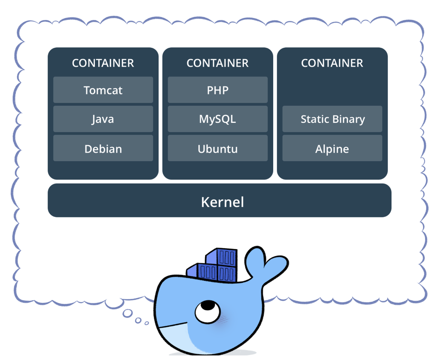

# Docker

- [Docker](#docker)
  - [Docker란?](#docker란)
    - [docker가 environment disparity 문제를 해결하는 방법](#docker가-environment-disparity-문제를-해결하는-방법)
  - [Docker architecture](#docker-architecture)
    - [Docker daemon (`dockerd`)](#docker-daemon-dockerd)
    - [Docker client (`docker`)](#docker-client-docker)
    - [Docker registry](#docker-registry)
    - [Docker objects](#docker-objects)
      - [Images](#images)
      - [Containers](#containers)

## Docker란?

docker는 environment disparity라는 문제점을 해결해준다

**environment disparity**

로컬에서 개발을 하고 배포하려고 코드를 서버에 올렸더니 작동을 안하네? 로컬 컴퓨터와 서버 컴퓨터의 환경(윈도우냐 리눅스냐와 같은)이 다르기 때문에 생기는 문제

→ docker를 통해 서로 다른 머신에서도 같은 환경을 구현할 수 있다

### docker가 environment disparity 문제를 해결하는 방법
예를 들어, 도커를 내 컴퓨터에도 설치하고 서버 컴퓨터에도 설치를 한다 → 그리고 Dockerfile이라는 것을 생성한다 → 여기에 구현하고 싶은 환경을 설정하면 된다(우분투, 파이썬, 깃 등등) → 이 파일을 내 컴퓨터, 서버 컴퓨터에 두면 → 도커는 이 파일을 읽고 필요한걸 다 다운로드 받아서 → 파일에 설정된 환경과 같은 Virtual Container(우분투, 파이썬, 깃 등등이 설치된)를 내 컴퓨터와 서버 컴퓨터에 동일하게 만든다 → 내 컴퓨터와 서버 컴퓨터에 동일한 환경을 구성했기 때문에 내 컴퓨터에서 서버 컴퓨터로 코드를 업로드 할 떄 잘 작동할 것이다!

도커 컨테이너들은 모두 분리, 독립되어 있다. 이 특징 덕분에 한 개의 서버에 각기 다른 많은 수의 컨테이너를 가질 수 있다. 예를 들어, 어떤 컨테이너는 node.js 컨테이너, 또 다른 컨테이너는 Java 컨테이너, Python 컨테이너와 같이. 그렇기 때문에 갑자기 Java 애플리케이션의 트래픽이 증가하면 동일한 Java 컨테이너의 수를 늘렸다가, 트래픽이 줄면 컨테이너를 줄일 수 있다. 매번 새로운 서버를 만들때마다 새로운 서버를 사고, 설정할 필요가 없는 것이다 → **그냥 컨테이너를 생성하고 원하는 수만큼 복제하면 된다**

    

하나의 같은 서버에 각기 다른 환경의 컨테이너를 설정할 수 있고, 각 컨테이너들은 독립되어 있다.

## Docker architecture
- 서버-클라이언트 구조를  사용한다
- 도커 클라이언트는 도커 데몬(도커 컨테이너를 빌드, 실행, 배포하는 무거운 작업을 수행한다)과 통신한다
- 도커 클라이언트와 데몬은 동일한 시스템에서 실행하거나, 도커 클라이언트를 원격 도커 데몬에 연결할 수 있다
- 도커 클라이언트와 데몬은 UNIXT 소켓 또는 네크워크 인터페이스를 통해 REST API를 사용해 통신한다
- 또 다른 도커 클라이언트는 컨테이너 세트로 구성된 애플리케이션으로 작업할 수 있는 도커 컴포즈이다

### Docker daemon (`dockerd`)
- 도커 API 요청을 수신하고 도커를 관리한다. 이미지, 컨테이너, 네트워크, 볼륨과 같은 개체
- 도커 서비스를 관리하기 위해 다른 데몬과 통신하는 것도 가능하다

### Docker client (`docker`)
- 도커 클라이언트는 도커 사용자가 도커와 상호작용하는 기본 방법이다
- `docker run`과 같은 명령을 사용하면 클라이언트가 명령을 dockerd로 보내어 수행한다
- 도커 명령은 도커 API를 사용한다
- 도커 클라이언트는 둘 이상의 데몬과 통신할 수 있다

### Docker registry
- 도커 이미지를 저장한다
- 도커 허브는 누구나 사용할 수 있는 레지스트리로 도커는 기본적으로 도커 허브에서 이미지를 찾도록 구성되어 있다
- private 레지스트리를 실행할 수도 있다
- `docker pull` 또는 `docker run` 명령을 사용하면 설정한 레지스트리에서 필요한 이미지를 가져온다
- `docker push` 명령을 사용하면 이미지가 설정된 레지스트리로 푸쉬된다

### Docker objects
도커를 사용하면 이미지, 컨테이너, 네트워크, 볼륨, 플러그인, 기타 개체를 만들고 사용하게 된다

#### Images
- 도커 컨테이너를 생성하기 위한 지침이 포함된 읽기 전용 템플릿이다
- 종종 이미지는 사용자 정의가 추가된 다른 이미지를 기반으로 한다
- 예를 들어 우분투 이미지를 기반으로 하는 이미지를 빌드할 수 있지만, 애플리케이션을 실행하는데 필요한 Apache 웹 서버, 애플리케이션과 같은 세부 구성 정보도 설치해야 한다
- 자신만의 이미지를 만들거나 다른 사람이 만들고 레지스트리에 게시한 이미지만 사용할 수 있다
- 자신의 고유한 이미지를 빌드하려면, 이미지를 만들고 실행하는데 필요한 단계가 정의된 Dockerfile을 만든다
- Dockerfile의 각 명령은 이미지에 계층을 생성한다. Dockerfile을 변경하고 이미지를 다시 빌드하면 변경된 계층만 다시 빌드된다
- 이 부분은 다른 가상화 기술과 비교할 때 이미지를 가볍고, 작고, 빠르게 만드는 부분이다

#### Containers
- 실행 가능한 이미지의 인스턴스이다
- Docker API 또는 CLI를 사용해서 컨테이너를 생성, 시작, 정지, 이동, 삭제할 수 있다
- 컨테이너를 하나 이상의 네트워크에 연결하거나 스토리지에 연결할 수 있다
- 컨테이너의 현재 상태를 기반으로 한 새로운 이미지를 생성할 수 있다
- 컨테이너는 다른 컨테이너 및 해당 호스트 시스템과 잘 격리되어 있다
- 컨테이너의 네트워크, 스토리지, 다른 컨테이너의 하위 시스템, 호스트 머신과 얼마나 격리할지 제어할 수 있다
- 컨테이너는 컨테이너를 만들거나 시작할 때 설정한 옵션과 이미지로부터 정의된다
- 컨테이너가 제거됐을 때, 영구 저장소에 저장되지 않은 변경 사항은 사라진다

 

---

 

참고 및 출처
- [노마드코더 유튜브](https://www.youtube.com/watch?v=chnCcGCTyBg)
- [docker docs](https://docs.docker.com/)