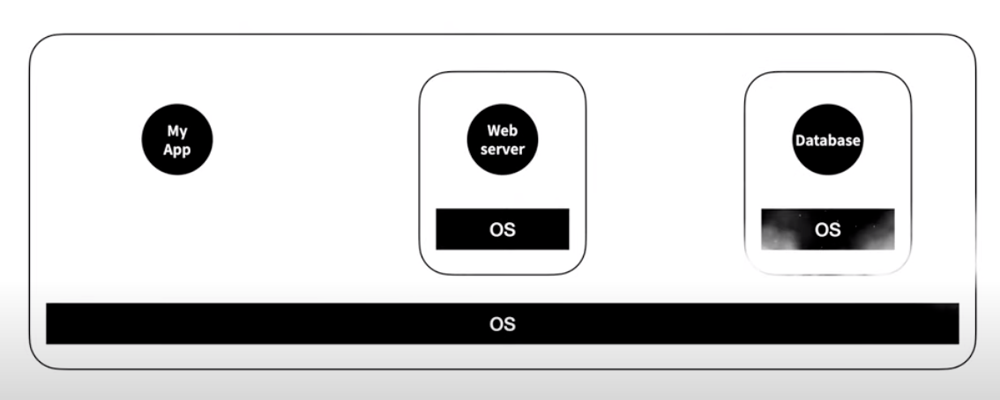

- [Docker](#docker)
    - [docker가 environment disparity 문제를 해결하는 방법](#docker가-environment-disparity-문제를-해결하는-방법)
  - [Install](#install)
  - [Image](#image)
  - [run](#run)
  - [네트워크](#네트워크)
  - [호스트와 컨테이너의 파일 시스템 연결](#호스트와-컨테이너의-파일-시스템-연결)
  - [Docker architecture](#docker-architecture)
    - [Docker daemon (`dockerd`)](#docker-daemon-dockerd)
    - [Docker client (`docker`)](#docker-client-docker)
    - [Docker registry](#docker-registry)
    - [Docker objects](#docker-objects)
      - [Images](#images)
      - [Containers](#containers)
  - [Dockerfile](#dockerfile)
    - [`ENTRYPOINT`](#entrypoint)
  - [Docker Compose CLI](#docker-compose-cli)
    - [`docker-compose up`](#docker-compose-up)
  - [etc](#etc)
    - [Manage application data](#manage-application-data)
      - [Volumes](#volumes)

# Docker

내 컴퓨터에서 어떤 애플리케이션을 만들기 위해서는 운영체제에 여러 애플리케이션을 설치해야 된다. 예를 들어, 웹 개발을 한다고 하면 웹 서버나 데이터베이스 같은 것을 설치해야 한다. 그런데 이런 애플리케이션을 설치하는 것은 까다롭고, 귀찮은 일(?)일 수 있다. 그럼 누군가 컴퓨터를 구해서 거기에 적당한 운영체제를 깔고, 그 위에 웹 서버를 설치한 다음에 그걸 전해준다면, 데이터베이스도 적당한 운영체제 위에 설치해서 준다면, 그리고 내 애플리케이션은 네트워크 통신을 통해서 이 애플리케이션들을 사용할 수 있다면 얼마나 좋을까? 그런데 이렇게 하려면 컴퓨터가 세 대나 필요하다(돈이 많이 든다). 

<br/>

<p align="center">
    
</p>
따라서 하나의 컴퓨터에 가상으로 컴퓨터를 만들고 그 위에 운영체제를 설치한 후에 애플리케이션을 설치한다면? 이렇게 되면 컴퓨터를 별도로 장만하지 않아도 된다. 그런데 겨우 웹 서버를 운영하기 위해 운영체제를 깔아야 한다는게 너무 아깝지 않나? 운영체제 하나의 용량이 클 뿐더러, 운영체제 위에 또 운영체제가 있다보니 실행 속도도 느려지게 된다.

<br/>
<p align="center">
    
</p>
따라서 한 대의 컴퓨터에서 각 애플리케이션을 격리된 환경에서 실행시키는건 어떨까?
운영체제가 설치된 컴퓨터를 주인이라는 뜻에서 host, 호스트에서 실행되는 격리된 각각의 실행환경을 container라고 부르자. 각각의 컨테이너에는 운영체제 전체가 설치되어 있는 것이 아니고 애플리케이션을 실행하는데 필요한 라이브러리와 실행 파일들만 포함되어 있다. 이미 존재하는 운영체제를 공유하니까 운영체제를 설치할 필요도 없고, 운영체제가 하나니까 속도도 느려지지 않는다. 그리고 저장장치의 용량도 아낄 수 있다.

리눅스 운영체제에는 이런 애플리케이션 실행 방법이 내장되어 있다. 이러한 기술을 **container** 부른다. 컨테이너 기술을 이용해서 이런 일을 쉽게 해주는 소프트웨어들이 여럿 있지만 그 중에서 가장 잘 나가는 제품이 **Docker**이다.

<br/>

docker는 environment disparity라는 문제점을 해결해준다

**environment disparity**

로컬에서 개발을 하고 배포하려고 코드를 서버에 올렸더니 작동을 안하네? 로컬 컴퓨터와 서버 컴퓨터의 환경(윈도우냐 리눅스냐와 같은)이 다르기 때문에 생기는 문제

→ docker를 통해 서로 다른 머신에서도 같은 환경을 구현할 수 있다

### docker가 environment disparity 문제를 해결하는 방법
예를 들어, 도커를 내 컴퓨터에도 설치하고 서버 컴퓨터에도 설치를 한다 → 그리고 Dockerfile이라는 것을 생성한다 → 여기에 구현하고 싶은 환경을 설정하면 된다(우분투, 파이썬, 깃 등등) → 이 파일을 내 컴퓨터, 서버 컴퓨터에 두면 → 도커는 이 파일을 읽고 필요한걸 다 다운로드 받아서 → 파일에 설정된 환경과 같은 Virtual Container(우분투, 파이썬, 깃 등등이 설치된)를 내 컴퓨터와 서버 컴퓨터에 동일하게 만든다 → 내 컴퓨터와 서버 컴퓨터에 동일한 환경을 구성했기 때문에 내 컴퓨터에서 서버 컴퓨터로 코드를 업로드 할 떄 잘 작동할 것이다!

도커 컨테이너들은 모두 분리, 독립되어 있다. 이 특징 덕분에 한 개의 서버에 각기 다른 많은 수의 컨테이너를 가질 수 있다. 예를 들어, 어떤 컨테이너는 node.js 컨테이너, 또 다른 컨테이너는 Java 컨테이너, Python 컨테이너와 같이. 그렇기 때문에 갑자기 Java 애플리케이션의 트래픽이 증가하면 동일한 Java 컨테이너의 수를 늘렸다가, 트래픽이 줄면 컨테이너를 줄일 수 있다. 매번 새로운 서버를 만들때마다 새로운 서버를 사고, 설정할 필요가 없는 것이다 → **그냥 컨테이너를 생성하고 원하는 수만큼 복제하면 된다**


<p align="center">
    
</p>

하나의 같은 서버에 각기 다른 환경의 컨테이너를 설정할 수 있고, 각 컨테이너들은 독립되어 있다.

## Install
도커와 같은 컨테이너 기술은 리눅스 운영체제의 기술이다. 따라서 도커 위에서 돌아가는 컨테이너와 그 컨테이너 안에서 동작하는 각각의 애플리케이션들은 리눅스 운영체제에서 동작하는 애플리케이션들이다. 그럼 내 컴퓨터가 리눅스 운영체제가 아니라면 도커를 사용할 수 없을까? 그건 아니고 내 컴퓨터에 가상머신을 설치하고, 그 가성머신에 리눅스 운영체제를 설치하면 리눅스 운영체제 위에서 도커와 같은 컨테이너 기술을 사용할 수 있다. 근데 이 방법은 복잡하고, 까다로울 수 있기 때문에 도커가 알아서 가상머신을 만들어주고 그 위에 리눅스를 설치해준다. 만약 내 컴퓨터가 리눅스라면 그 위에서 바로 도커가 실행되기 때문에 성능의 저하가 없다. 내 컴퓨터가 리눅스가 아니라면 가상머신을 설치하기 때문에 어느 정도의 속도 저하를 감수해야 한다.

## Image
앱 스토어와 같이 docker hub라는 registry 서비스에서 필요한 소프트웨어를 찾는다. 앱 스토어에서 다운로드받아서 컴퓨터에 저장한 것을 프로그램이라고 한다면, docker hub에서 다운로드받아 내 컴퓨터에 가지고 있는 것을 **Image**라고 한다. 프로그램을 실행하면 프로세스라는 것이 동작을 하는 것과 같이 이미지를 실행하는 것을 컨테이너라고 한다. 프로그램이 여러 개의 프로세스를 가질 수 있는 것처럼 이미지도 여러 개의 컨테이너를 가질 수 있다.

docker hub에서 이미지를 다운로드 받는 행위를 pull이라고 한다. 이미지를 실행시키는 행위를 run이라고 한다. run을 하게 되면 이미지가 컨테이너가 되고, 컨테이너가 실행되면서 컨테이너 안에 포함되어 실행되도록 조치되어 있는 프로그램이 실행되면서 우리는 그 프로그램을 사용할 수 있게 되는 것이다. 

## run
이미지를 run 하면 여러 개의 컨테이너가 있을 수 있고, 컨테이너들의 이름을 잘 지정해둬야 관리하기 편하다.

이미지를 run 하면 컨테이너가 실행이 되면서 컨테이너 안에 프로세스도 실행되는 것이다. docker GUI에서 실행 중인 컨테이너를 클릭하면 컨테이너 안에서 실행되고 있는 프로세스가 출력하는 로그를 확인할 수 있다. 그리고 컨테이너는 어쨌든 컴퓨터의 자원을 사용하기 때문에 stats 정보를 볼 수 있다. 

```bash
docker run [OPTIONS] IMAGE [COMMAND] [ARG...]
```
- IMAGE의 이름 뒤에는 컨테이너 안에서 실행하고 싶은 명령어

stop 했다고 컨테이너가 삭제되는 것은 아니다. stop 했던 것을 다시 실행하고 싶다면 run이 아니라 start를 사용한다

## 네트워크
도커로 동작하는 많은 애플리케이션들이 네트워크를 이용한다.

<br/>

<p align="center">
    
</p>

예를 들어, 도커 없이 웹 서버를 사용하려면 두 대의 컴퓨터가 필요하다. 한 대의 컴퓨터에는 웹 브라우저가 설치되어 있다. 다른 컴퓨터에는 웹 서버가 설치되어 있고, 웹 페이지를 파일로 만들어서 저장장치의 특정 디렉토리(파일 시스템)에 위치 시킨다(/usr/local/apache2/httpdocs/index.html). 그리고 웹 서버에 웹 페이지를 요청하면 이 디렉토리에서 찾아야 한다는 설정을 해 놓는다. 컴퓨터에는 6만 5천개의 포트라는 개념이 있어서 컴퓨터에 설치되어 있는 여러 소프트웨어들을 네트워크적으로 구분해준다. 이 개념이 없다면 컴퓨터로 요청이 들어왔을 때 어떤 소프트웨어가 그 요청을 처리해야되는지 알 수가 없다. 웹 서버는 80번 포트에서 요청을 대기하고 있도록 설정되어 있다. 그리고 웹 서버가 설치된 컴퓨터의 주소는 example.com이라고 했을 때 웹 브라우저가 설치된 컴퓨터에서 웹 브라우저의 주소창에 http://example.com:80/index.html을 입력해 요청하면, 웹 브라우저는 example.com의 80번 포트로 접속하게 된다. 80번 포트에는 웹 서버가 대기중이기 때문에 웹 서버로 요청이 전달되고, 웹 서버는 /usr/local/apache2/httpdocs 디렉토리에서 index.html 파일을 읽어서 index.html 파일의 코드를 웹 브라우저에게 전달하면 이 과정이 끝난다.

<br/>

<p align="center">
    
</p>
도커를 사용해서 웹 서버를 사용하는 방법을 살펴보면, 도커를 이용하면 웹 서버를 컴퓨터에 직접 설치하지 않는다. 도커를 이용하면 웹 서버가 컨테이너에 설치된다. 컨테이너가 떠있는 운영체지를 host라고 부르고, 하나의 host에는 여러 개의 컨테이너가 만들어질 수 있다. 컨테이너와 호스트 모두 독립적인 실행환경이기 때문에 각자 독립적인 포트와 파일 시스템을 가지고 있다. 

<br/>

<p align="center">
    
</p>
웹 브라우저로 웹 서버에 접속을 하려고 하면 호스트와 컨테이너는 연결이 끊겨 있기 때문에 웹 서버로 접속이 되지 않는다. 따라서 호스트의 80번 포트와 컨테이너의 80번 포트를 연결해주면 된다.

```bash
docker run -p 80:80 httpd
```

<p align="center">
    
</p>

컨테이너를 실행하는 명령을 위와 같이 하면 호스트와 컨테이너의 포트가 연결이 된다. 그럼 호스트의 80번 포트로 들어온 요청이 컨테이너의 80번 포트로 전송이 된다. 이렇게 연결된 포트로 요청을 전달하는 것을 port forwarding이라고 한다. 

## 호스트와 컨테이너의 파일 시스템 연결
컨테이너 안으로 들어가서 컨테이너의 파일 시스템에 저장된 파일을 수정했는데 만약 컨테이너가 사라진다면 작업한 내용이 물거품이 된다. 따라서 호스트의 파일 시스템과 컨테이너의 파일 시스템을 연결하고, 호스트의 파일 시스템이 변경되었을 때 컨테이너의 파일 시스템에 반영될 수 있다면 컨테이너가 사라져도 수정된 내용은 여전히 호스트에 남아있기 때문에 보다 안전하게 개발을 지속할 수 있다. 
```bash
docker run -p 8888:80 -v ~/Desktop/httpdocs:/usr/local/apache2/httpdocs/ httpd
```

## Docker architecture
- 서버-클라이언트 구조를  사용한다
- 도커 클라이언트는 도커 데몬(도커 컨테이너를 빌드, 실행, 배포하는 무거운 작업을 수행한다)과 통신한다
- 도커 클라이언트와 데몬은 동일한 시스템에서 실행하거나, 도커 클라이언트를 원격 도커 데몬에 연결할 수 있다
- 도커 클라이언트와 데몬은 UNIXT 소켓 또는 네크워크 인터페이스를 통해 REST API를 사용해 통신한다
- 또 다른 도커 클라이언트는 컨테이너 세트로 구성된 애플리케이션으로 작업할 수 있는 도커 컴포즈이다

### Docker daemon (`dockerd`)
- 도커 API 요청을 수신하고 도커를 관리한다. 이미지, 컨테이너, 네트워크, 볼륨과 같은 개체
- 도커 서비스를 관리하기 위해 다른 데몬과 통신하는 것도 가능하다

### Docker client (`docker`)
- 도커 클라이언트는 도커 사용자가 도커와 상호작용하는 기본 방법이다
- `docker run`과 같은 명령을 사용하면 클라이언트가 명령을 dockerd로 보내어 수행한다
- 도커 명령은 도커 API를 사용한다
- 도커 클라이언트는 둘 이상의 데몬과 통신할 수 있다

### Docker registry
- 도커 이미지를 저장한다
- 도커 허브는 누구나 사용할 수 있는 레지스트리로 도커는 기본적으로 도커 허브에서 이미지를 찾도록 구성되어 있다
- private 레지스트리를 실행할 수도 있다
- `docker pull` 또는 `docker run` 명령을 사용하면 설정한 레지스트리에서 필요한 이미지를 가져온다
- `docker push` 명령을 사용하면 이미지가 설정된 레지스트리로 푸쉬된다

### Docker objects
도커를 사용하면 이미지, 컨테이너, 네트워크, 볼륨, 플러그인, 기타 개체를 만들고 사용하게 된다

#### Images
- 도커 컨테이너를 생성하기 위한 지침이 포함된 읽기 전용 템플릿이다
- 종종 이미지는 사용자 정의가 추가된 다른 이미지를 기반으로 한다
- 예를 들어 우분투 이미지를 기반으로 하는 이미지를 빌드할 수 있지만, 애플리케이션을 실행하는데 필요한 Apache 웹 서버, 애플리케이션과 같은 세부 구성 정보도 설치해야 한다
- 자신만의 이미지를 만들거나 다른 사람이 만들고 레지스트리에 게시한 이미지만 사용할 수 있다
- 자신의 고유한 이미지를 빌드하려면, 이미지를 만들고 실행하는데 필요한 단계가 정의된 Dockerfile을 만든다
- Dockerfile의 각 명령은 이미지에 계층을 생성한다. Dockerfile을 변경하고 이미지를 다시 빌드하면 변경된 계층만 다시 빌드된다
- 이 부분은 다른 가상화 기술과 비교할 때 이미지를 가볍고, 작고, 빠르게 만드는 부분이다

#### Containers
- 실행 가능한 이미지의 인스턴스이다
- Docker API 또는 CLI를 사용해서 컨테이너를 생성, 시작, 정지, 이동, 삭제할 수 있다
- 컨테이너를 하나 이상의 네트워크에 연결하거나 스토리지에 연결할 수 있다
- 컨테이너의 현재 상태를 기반으로 한 새로운 이미지를 생성할 수 있다
- 컨테이너는 다른 컨테이너 및 해당 호스트 시스템과 잘 격리되어 있다
- 컨테이너의 네트워크, 스토리지, 다른 컨테이너의 하위 시스템, 호스트 머신과 얼마나 격리할지 제어할 수 있다
- 컨테이너는 컨테이너를 만들거나 시작할 때 설정한 옵션과 이미지로부터 정의된다
- 컨테이너가 제거됐을 때, 영구 저장소에 저장되지 않은 변경 사항은 사라진다

## Dockerfile
- 도커는 도커파일의 지침을 읽어 자동으로 이미지를 빌드할 수 있다
- 도커파일은 모든 명령을 포함하는 텍스트 문서이다

### `ENTRYPOINT`
- 실행 파일로 실행할 컨테이너를 구성할 수 있다

## Docker Compose CLI

### `docker-compose up`
- 서비스를 위한 컨테이너를 빌드, (재)생성, 시작, 연결
- 실행중이 아니면, 연결되 서비스도 시작한다
- 각 컨테이너의 출력을 집계한다(기본적으로 `docker-compose logs --follow` 실행)
- 명령이 종료되면 모든 컨테이너가 중지된다
- `docker-compose up --detach`를 실행하면 백그라운드에서 컨테이너를 시작하고 계속 실행한다
- 서비스에 대한 기존 컨테이너가 있고 컨테이너 생성 후 서비스의 구성이나 이미지가 변경된 경우, `docker-compose up`은 컨테이너를 중지하고 다시 생성하여 변경 사항을 선택한다(마운트된 볼륨 유지)
- Compose에서 변경 사항을 선택하지 않도록 하려면 `--no-recreate` 플래그를 사용한다
- Compose가 모든 컨테이너를 중지하고 다시 생성하도록 하려면 `--force-recreate` 플래그를 사용한다

## etc

### Manage application data

#### Volumes

<br/>

---

<br/>

참고 및 출처
- [노마드코더 유튜브](https://www.youtube.com/watch?v=chnCcGCTyBg)
- [docker docs](https://docs.docker.com/)
- [생활코딩 Docker 입구 수업](https://www.youtube.com/watch?v=Ps8HDIAyPD0&list=PLuHgQVnccGMDeMJsGq2O-55Ymtx0IdKWf&index=1)