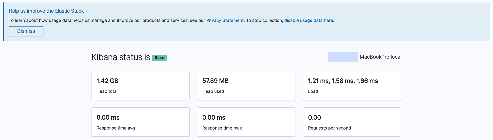
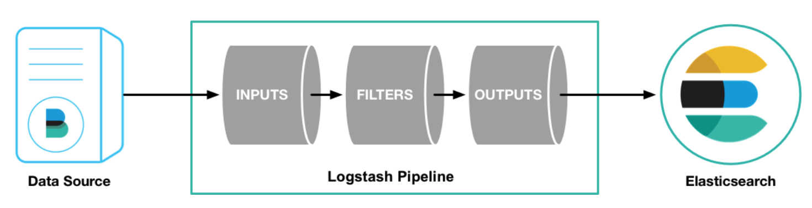
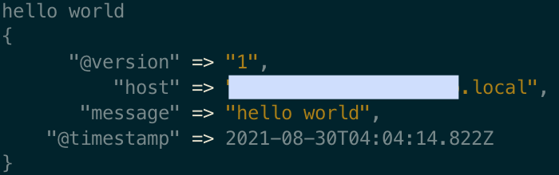

# Mac에 ELK Stack 구성하기

### 1. Homebrew 설치 or 업데이트

### 2. Java 8 설치, 환경변수 변경

[Logstash 설치](https://www.elastic.co/guide/kr/logstash/current/installing-logstash.html)

Logstash는 Java9를 지원하지 않기 때문에 Java8 설치 후 ```JAVA_HOME``` 환경변수를 변경해야 한다

**JAVA_HOME 환경변수 변경**

파일 열기

```bash
vi ~/.bash_profile
```

파일 내용 변경

```bash
export JAVA_HOME=/Library/Java/JavaVirtualMachines/jdk1.8.0_설치한버전.jdk/Contents/Home
```

환경변수 다시 로드
```bash
source ~/.bash_profile
```

### 3. Elasticsearch 설치, 시작

**설치**
```bash
brew install elasticsearch && brew info elasticsearch
```

**시작**
```bash
brew services start elasticsearch
```

**확인**
```bash
curl -X GET localhost:9200
```
또는 브라우저로 `http://localshot:9200` 에 접속해 아래와 같은 내용이 나오는지 확인
```json
{
    "name": "XXXXXX",
    "cluster_name": "XXXXX",
    ...
}
```

### 4. Logstash 설치, 시작

**설치**
```bash
brew install logstash
```

**시작**
```bash
brew services start logstash
```

### 5. Kibana 설치, 설정, 시작

**설치**
```bash
brew install kibana
```

**설정**

설정 파일 열기
```bash
sudo vi /usr/local/etc/kibana/kibana.yml
```

파일 내용 변경
- `server.port`, `elasticsearch.hosts` 라인의 주석 해제
- `server.host` 라인의 주석 해제, `server.hosts:"0.0.0.0"`으로 변경

**시작**
```bash
brew services start kibana
```

**확인**

브라우저로 `http://localhost:5601/status` 에 접속해 아래와 같은 내용이 보여지는지 확인

<p align="center">
    
</p>


<br/>

# Logstash

## 파이프라인
- 데이터를 입력받아 실시간으로 변경하고 이른 다른 시스템에 전달하는 역할을 하는 기능이다
- 입력(필수), 필터(옵션), 출력(필수) 세 가지 요소로 이뤄진다
- 입력, 필터, 출력 각 단계에서 복수의 플러그인을 포함시킬 수 있다

<p align="center">
    
</p>

<br/>

### 콘솔에서 파이프라인 설정하기

일반적으로 파이프라인은 따로 설정 파일을 만들어 기록하는데 `-e` 옵션을 사용하면 콘솔에서 직접 파이프라인을 설정할 수 있다.

아래 파이프라인은 표준 **입력(키보드)** 을 받아서 표준 **출력(모니터)** 에 보여주는 파이프라인이다.

```bash
cd /usr/local/Cellar/logstash/7.14.0/bin
logstash -e "input { stdin { } } output { stdout { } }"
```

위 명령어를 콘솔에 입력 후 "hello world"를 타이핑하면 아래와 같은 결과를 확인할 수 있다.

<p align="center">
    
</p>

### 파이프라인 기본 템플릿
```
input {
    { 입력 플러그인 }
}

filter {
    { 필터 플러그인 }
}

output {
    { 출력 플러그인 }
}
```


<br/>

---

<br/>

출처 및 참고
- [Getting Started with Logstash](https://www.elastic.co/guide/en/logstash/7.10/first-event.html)
