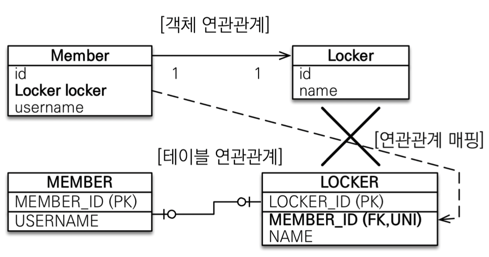
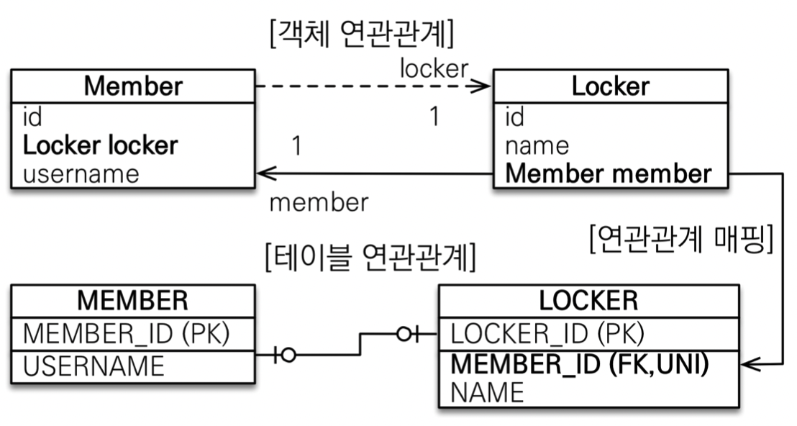

- [연관관계 매핑](#연관관계-매핑)
  - [일대일 1 : 1](#일대일-1--1)
    - [주 테이블에 외래 키 단방향](#주-테이블에-외래-키-단방향)
    - [주 테이블에 외래 키 양방향](#주-테이블에-외래-키-양방향)
    - [대상 테이블에 외래 키 단방향](#대상-테이블에-외래-키-단방향)
    - [대상 테이블에 외래 키 양방향](#대상-테이블에-외래-키-양방향)

# 연관관계 매핑

## 일대일 1 : 1
- `@OneToOne`
- 주 테이블이나 대상 테이블 중에 외래 키를 추가
- 외래 키가 있는 곳이 연관관계의 주인
- DB 입장에서는 외래 키에 데이터베이스 유니크 제약조건이 추가가 되어 있어야한다(없어도 되지만 그럼 애플리케이션 단에서 관리가 어려움)

### 주 테이블에 외래 키 단방향

주 테이블

```java
...
public class Member {
    
    ...

    @OneToOne
    @JoinColumn(name = "LOCKER_ID")
    private Locker locker;

    ...
}
```

### 주 테이블에 외래 키 양방향

주 테이블

```java
...
public class Member {
    
    ...

    @OneToOne
    @JoinColumn(name = "LOCKER_ID")
    private Locker locker;

    ...
}
```

대상 테이블

```java
...
public class Locker {

    ...

    @OneToOne(mappedBy = "locker")
    private Member member;

    ...
}
```

### 대상 테이블에 외래 키 단방향
<p align="center">
    
</p>
- Member Entity에 Locker를 추가하고 연관관계의 주인으로 하고 싶은데 DB에서 외래 키는 LOCKER에 있다면, Member로 Locker를 관리하는 것은 불가능 → 양방향에서는 지원

### 대상 테이블에 외래 키 양방향
<p align="center">
    
</p>
- Locaker에 있는 member를 연관관계의 주인으로 매핑을 하고, Member에 있는 locker는 읽기전용으로 만들면 된다
- 주 테이블에 외래 키 양방향 매핑과 방법은 같음

<br/>

--- 

<br/>

출처
- [자바 ORM 표준 JPA 프로그래밍 - 기본편](https://www.inflearn.com/course/ORM-JPA-Basic/dashboard)