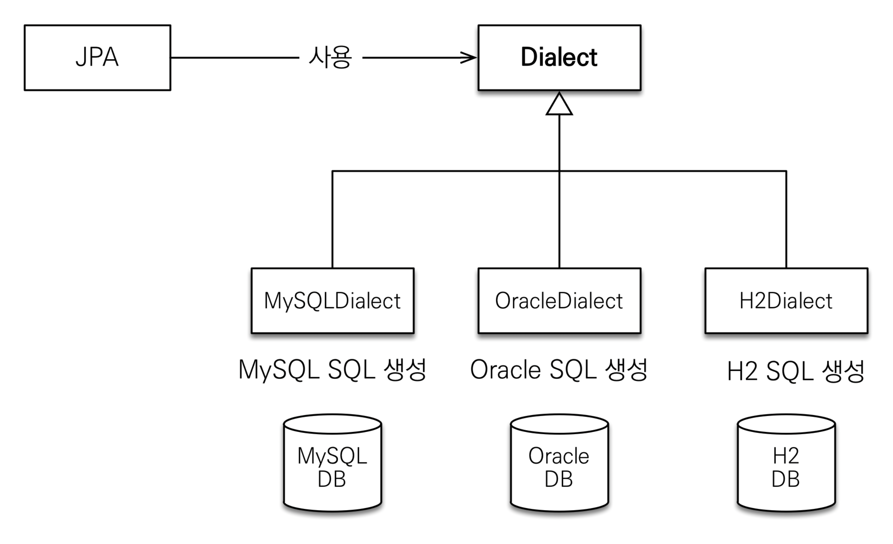

- [hibernate](#hibernate)
  - [라이브러리 추가](#라이브러리-추가)
  - [dialect](#dialect)

# hibernate

## 라이브러리 추가

```gradle
dependencies {
    implementation 'org.hibernate:hibernate-entitymanager:5.6.8.Final'
}
```

`orm.hibernate`
- JPA(인터페이스)의 구현체로 hibernate를 선택한 것

`hibernate-entitymanager`
- 여러 라이브러리를 추가해준다
  - `hibernate-core`
  - `javax.persistence:javax.persistence-api`
    - 선택한 구현체인 hibernate가 JPA 인터페이스를 가지고 있는 것
  
## dialect
데이터베이스 방언
- JPA는 특정 데이터베이스에 종속되지 않도록 설계되어 있다 → MySQL을 쓰다가 H2로 바꿔도 크게 큰 변경없이 작동해야 한다
- 각각의 데이터베이스가 제공하는 SQL 문법과 함수가 조금씩 다른데, 이처럼 SQL 표준을 지키지 않는 특정 데이터베이스만의 고유한 기능을 방언이라 한다
- JPA 설정 정보 중 `hibernate.dialect` 속성에 지정
- hibernate는 40가지 이상의 데이터베이스 방언 지원
<p align="center">
    
</p>

<br/>

--- 

<br/>

출처
- [자바 ORM 표준 JPA 프로그래밍 - 기본편](https://www.inflearn.com/course/ORM-JPA-Basic/dashboard)

