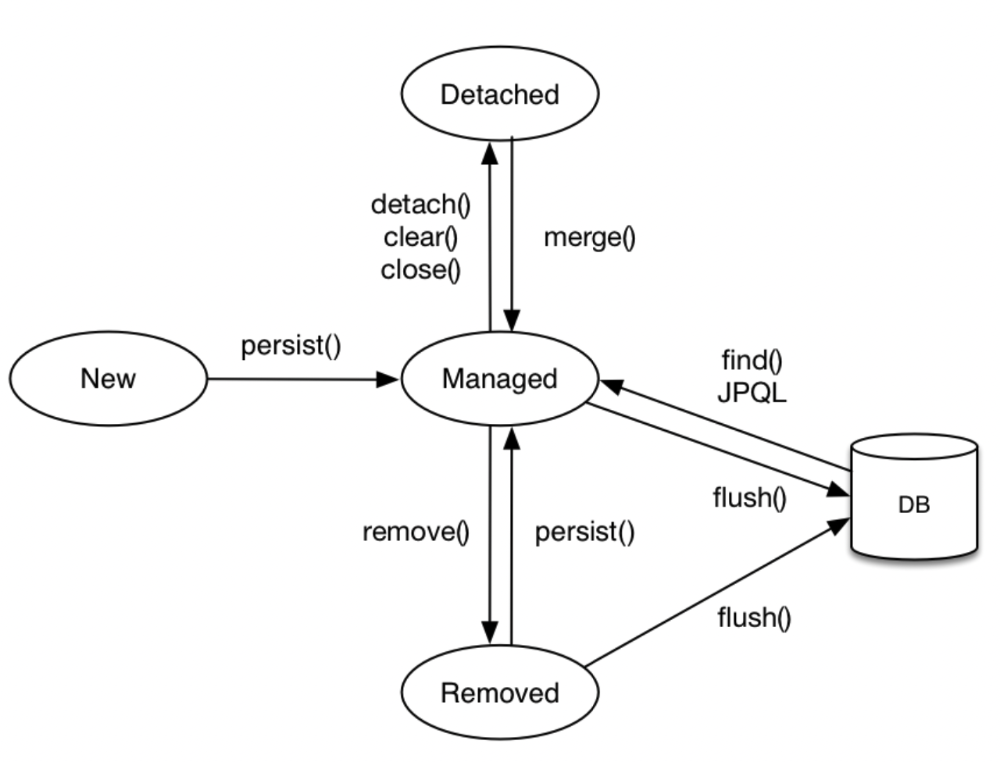

- [영속성 컨텍스트](#영속성-컨텍스트)
  - [엔티티의 생명주기](#엔티티의-생명주기)
  - [영속성 컨텍스트의 이점](#영속성-컨텍스트의-이점)

# 영속성 컨텍스트
- "엔티티를 영구 저장하는 환경"이라는 뜻의 **논리적인 개념**(눈에 보이지 않는다)
- `EntityManager`를 통해 영속성 컨텍스트에 접근

## 엔티티의 생명주기

<p align="center">
    
</p>

- 비영속 (New/Transient)
  - 영속성 컨텍스트와 전혀 관계가 없는 새로운 상태
- 영속 (Managed)
  - 영속성 컨텍스트에 관리되는 상태
    ```java
    Member member = new Member();
    ...

    EntityManager em = emf.createEntityManager();
    ...

    em.persist(member); // em의 영속성 컨텍스트에 저장. DB에 저장 X
    ```
- 준영속 (Detached)
  - 영속성 컨텍스트에 저장되었다가 분리된 상태
- 삭제 (Removed)
  - 삭제된 상태

## 영속성 컨텍스트의 이점


<br/>

--- 

<br/>

출처
- [자바 ORM 표준 JPA 프로그래밍 - 기본편](https://www.inflearn.com/course/ORM-JPA-Basic/dashboard)