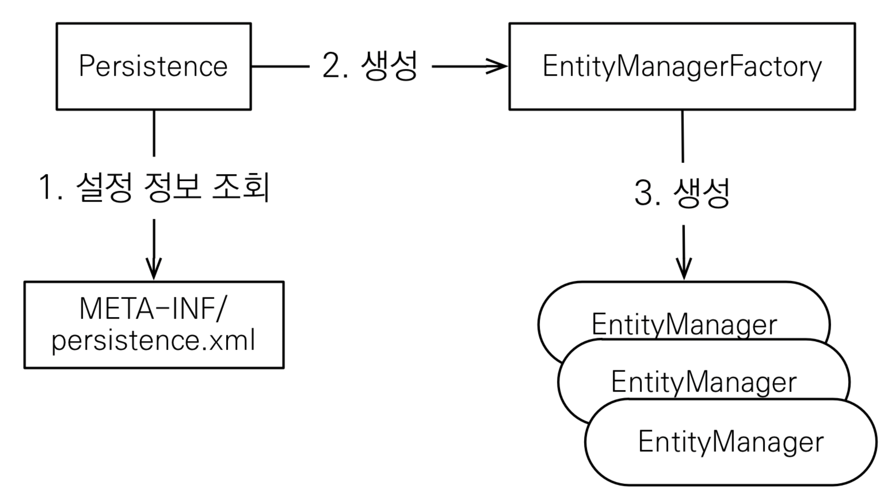

- [JPA 구동 방식](#jpa-구동-방식)

# JPA 구동 방식

<p align="center">
    
</p>

```java
EntityManagerFactory emf = Persistence.createEntityManagerFactory("jpa");
EntityManager em = emf.createEntityManager();

EntityTransaction tx = em.getTransaction();
tx.begin();

try {
    // CRUD

    tx.commit();
} catch (Exception e) {
    tx.rollback();
} finally {
    em.close();
}
```
- `Persistence` : `Persistence` class는 설정 정보(`persistence.xml`)를 읽어서 `EntityManagerFactory`를 생성한다
- `EntityManagerFactory` : 애플리케이션이 로드될 때 딱 1개만 생성된다. 애플리케이션 전체에서 공유
- `EntityManager` : 필요할 때 마다 생성해서 사용하는데, 보통 트랜잭션 단위로 생성한다. 데이터베이스 커넥션을 가지고 있고, 쓰레드간 공유하면 안된다. 사용하고 다면 `em.close()`를 해줘야 한다.
- `EntityTransaction` : JPA에서 데이터를 변경하는 모든 작업은 트랜잭션 안에서 처리되어야 한다
    ```shell
    No EntityManager with actual transaction available for current thread
    ```
    - 그렇지 않으면 이런 에러가 발생한다


<br/>

--- 

<br/>

출처
- [자바 ORM 표준 JPA 프로그래밍 - 기본편](https://www.inflearn.com/course/ORM-JPA-Basic/dashboard)