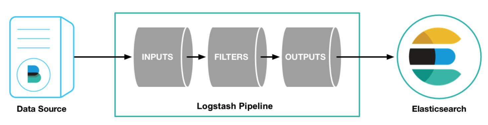
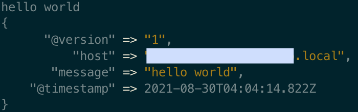

- [Logstash](#logstash)
  - [파이프라인](#파이프라인)
    - [콘솔에서 파이프라인 설정하기](#콘솔에서-파이프라인-설정하기)
    - [파이프라인 기본 템플릿](#파이프라인-기본-템플릿)
  - [입력](#입력)
    - [파일 플러그인을 통한 입력](#파일-플러그인을-통한-입력)
    - [JDBC 플러그인을 통한 입력](#jdbc-플러그인을-통한-입력)
      - [`prepared_statement_bind_values`가 적용되지 않을 때](#prepared_statement_bind_values가-적용되지-않을-때)
  - [필터](#필터)
    - [`mutate` 플러그인](#mutate-플러그인)

# Logstash

## 파이프라인
- 데이터를 입력받아 실시간으로 변경하고 이를 다른 시스템에 전달하는 역할을 하는 기능이다
- 입력(필수), 필터(옵션), 출력(필수) 세 가지 요소로 이뤄진다
- 입력, 필터, 출력 각 단계에서 복수의 플러그인을 포함시킬 수 있다

<p align="center">
    
</p>

<br/>

### 콘솔에서 파이프라인 설정하기

일반적으로 파이프라인은 따로 설정 파일을 만들어 기록하는데 `-e` 옵션을 사용하면 콘솔에서 직접 파이프라인을 설정할 수 있다.

아래 파이프라인은 표준 **입력(키보드)** 을 받아서 표준 **출력(모니터)** 에 보여주는 파이프라인이다.

```bash
cd /usr/local/Cellar/logstash/7.14.0/bin
logstash -e "input { stdin { } } output { stdout { } }"
```

- `stdin` : 표준 입력 플러그인
- `stdout` : 표준 출력 플러그인

위 명령어를 콘솔에 입력 후 "hello world"를 타이핑하면 아래와 같은 결과를 확인할 수 있다.

<p align="center">
    
</p>

### 파이프라인 기본 템플릿
```
input {
    { 입력 플러그인 }
}

filter {
    { 필터 플러그인 }
}

output {
    { 출력 플러그인 }
}
```

## 입력

파일, 통계, 웹, 데이터베이스, 스트림 등 다양한 입력을 받아들일 수 있고, 읽어 들인 데이터를 쉽게 처리하기 위해 다양한 입력 플러그인들이 존재한다([전체 입력 플러그인](https://www.elastic.co/guide/en/logstash/7.10/input-plugins.html)).

### 파일 플러그인을 통한 입력

1. 파이프라인 설정 파일 만들기
   1. 로그스태시가 설치된 디렉토리에 `config` 디렉토리를 만들고, `logstash-test.conf` 라는 이름으로 설정 파일을 만든다(설정 파일의 위치는 크게 중요하지 않으며, 확장자가 꼭 `conf`일 필요도 없다)
2. `logstash-test.conf` 파일에 파일 입력 플러그인을 적용하기
   ```
   input {
        file {
            path => "/usr/local/var/log/elasticsearch.log"
            start_position => "beginning"
        }
    }

    output {
        stdout { }
    }
   ```
    - 입력으로 `file` 플러그인을 사용, 출력으로 표준 출력 `stdout` 플러그인을 사용
    - 파일 플러그인에는 여러 옵션이 있다
      - `path` : 읽어 들일 파일 위치. 파일에 로그가 쌓이면 실시간으로 파일의 변경을 감지해 읽어 들인다
      - `start_position` : 최초 파일을 발견했을 때 파일을 읽을 위치로, 파일의 시작 부분부터 읽어 들일지, 끝부분부터 새로운 라인만 읽어 들일지 정할 수 있다
3. 읽어 들일 파일로 지정한 `elasticsearch.log`를 수집하기 위해 엘라스틱서치를 실행하고, 로그스태시를 실행
   ```bash
   brew services start elasticsearch
   ```
   ```bash
   /usr/local/Cellar/logstash/7.14.0/bin/logstash -f ../config/logstash-test.conf
   ```
   - `-f` 옵션 : 설정 파일이나 폴더를 지정하는 옵션. `logstash-test.conf`를 파이프라인 설정에 사용

### JDBC 플러그인을 통한 입력

#### `prepared_statement_bind_values`가 적용되지 않을 때

만약, 다음과 같은 에러가 발생했다면

```bash
Pipeline error {:pipeline_id=>"main", :exception=>#<LogStash::ConfigurationError: Prepared Statement Mode validation errors: JDBC pagination cannot be used at this time>,
```

jdbc input plugin의 공식 문서를 보면 다음과 같은 내용이 있다.

> **_NOTE:_**  Building count queries around a prepared statement is not supported at this time and because jdbc paging uses count queries under the hood, jdbc paging is not supported with prepared statements at this time either. Therefore, jdbc_paging_enabled, jdbc_page_size settings are ignored when using prepared statements.

prepared statement를 사용할 때 `jdbc_paging_enabled`, `jdbc_page_size`가 적용되지 않는다

## 필터

입력 플러그인이 받은 데이터를 의미 있는 데이터로 구조화하는 역할을 한다. 비정형 데이터를 정형화하고 데이터 분석을 위한 구조를 잡아준다(전반적인 데이터 정제/가공 작업을 수행).

다양한 필터 플러그인이 존재한다([전체 필터 플러그인](https://www.elastic.co/guide/en/logstash/7.10/filter-plugins.html)).

### `mutate` 플러그인
필드명을 변경하거나 문자열 처리 등 필드를 변경하는 일반적인 가공 함수들을 제공한다. 또한 다양한 내부 옵션이 있다.

```
...
filter {
    mutate {
        split => { "message" => " "}
    }
}
...
```
`split` 옵션을 적용해 공백 기준으로 문자를 분리

<br/>

---

<br/>

출처 및 참고
- [Getting Started with Logstash](https://www.elastic.co/guide/en/logstash/7.10/first-event.html)
- 엘라스틱 스택 개발부터 운영까지(김준영, 정상운)
- [Jdbc input plugin](https://www.elastic.co/guide/en/logstash/master/plugins-inputs-jdbc.html#plugins-inputs-jdbc-use_column_value)