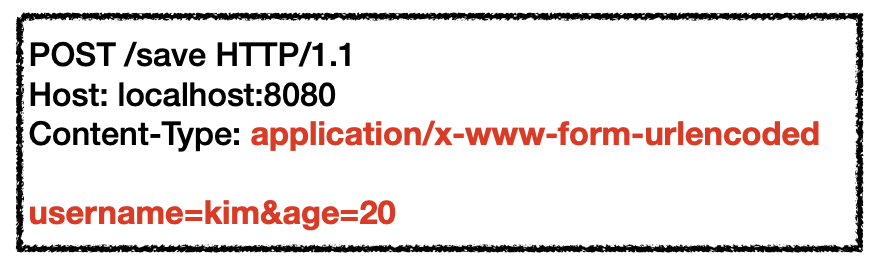
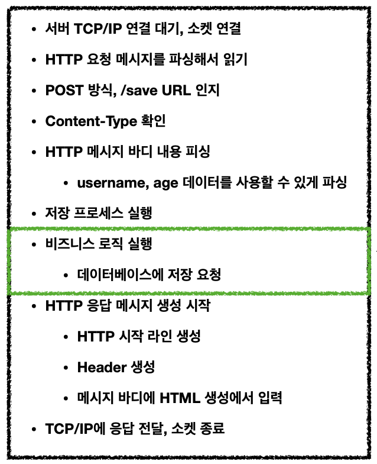
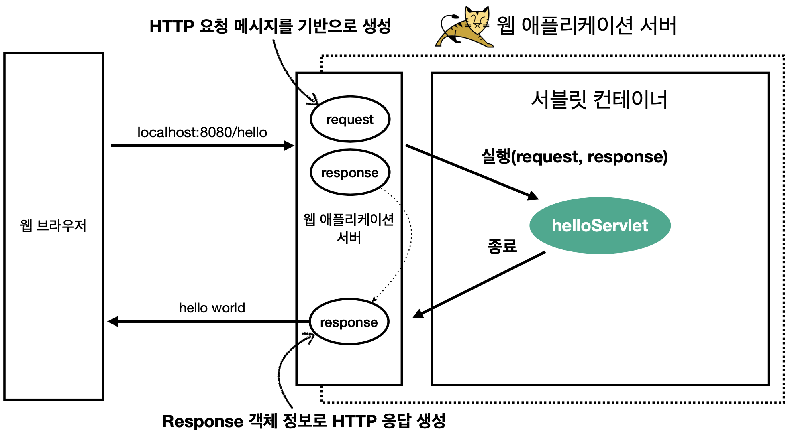
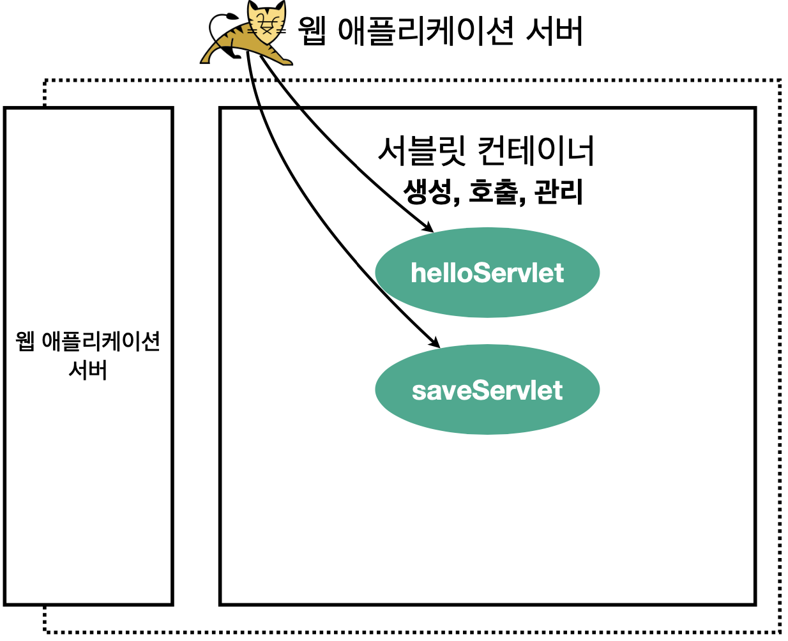

# 서블릿

예를 들어 웹 브라우저에서 요청이 발생하면, 웹 브라우저는 HTTP 메시지를 만들어 서버로 요청 메시지를 전송한다.

<p align="center">
    
</p>

만약, WAS를 직접 구현한다면

<p align="center">
    
</p>

모든 요청에 공통으로 필요한 기능(위 이미지에서 녹색 테두리가 쳐진 부분을 제외한) + 비즈니스 로직을 매번 구현해야된다. 서블릿은 모든 요청에 공통으로 필요한 기능을 개발자가 직접 구현하지 않도록 지원하는 **WAS의 Java 프로그램**이다. 따라서, 서블릿을 지원하는 WAS를 사용하면 비즈니스 로직 부분을 제외한 부분은 WAS가 처리를 해준다.

서블릿은 Java 클래스의 일종으로, 특정 요청을 처리하기 위해서는 서블릿이 요구하는 구현 규칙만 지켜 구현하면 된다.

```java
@WebServlet(name = "helloServlet", urlPatterns = "/hello")
public class HelloServlet extends HttpServlet {

    @Override
    protected void service(HttpServletRequest request, HttpServletResponse response) {
        // 애플리케이션 로직
    }
}
```
위 코드는 `urlPatterns`(/hello)의 URL이 호출되었을 때 실행되는 서블릿 코드이다. 


<p align="center">
    
</p>

WAS는 HTTP 요청을 받으면 HTTP 요청 메시지를 기반으로 `HttpServletRequest`와 `HttpServletResponse` 객체를 생성한다. `HttpServletRequest`는 HTTP 요청 정보를 편리하게 사용할 수 있도록 지원하며, `HttpServletResponse`는 HTTP 응답 정보를 편리하게 제공할 수 있도록 지원한다. 이를 통해 개발자는 HTTP 스펙을 매우 편리하게 사용할 수 있다.

WAS는 Request, Response 객체를 새로 만들어 서블릿 객체를 호출한다(Request, Response 객체를 `helloServlet`의 `service()` 메서드 파라미터로 전달). 서블릿 코드가 종료되면 WAS는 Response 객체에 담겨있는 내용으로 HTTP 응답 정보를 생성한다.

<br/>

### 서블릿 컨테이너

<p align="center">
    
</p>

- 톰캣처럼 서블릿을 지원하는 WAS를 서블릿 컨테이너라고 한다. 서블릿은 개발자가 직접 생성하고, 호출하는게 아니라 서블릿 컨테이너가 생성, 초기화, 호출, 종료하는 생명주기를 관리한다.

- 서블릿 컨테이너는 서블릿 객체를 싱글톤으로 관리한다. HTTP 요청은 모두 다른 것이기 때문에 `HttpServletRequest`와 `HttpServletResponse`는 각 요청마다 생성되지만 서블릿은 모든 요청이 동일하게 사용하는 코드이기 때문에 요청이 올 때마다 서블릿 객체를 생성하는 것은 비효율적이기 때문이다. 따라서 모든 요청은 동일한 서블릿 객체 인스턴스에 접근하게 되고, 공용 변수 사용에 주의해야 한다. 

- 서블릿 컨테이너는 JSP도 서블릿으로 변환 되어서 사용한다.

- 서블릿 컨테이너는 동시 요청을 위한 멀티 쓰레드 처리를 지원한다. 따라서 천명, 만명의 동시 요청을 개발자가 신경쓰지 않아도 되는 것이다.
  - 멀티 쓰레드에 대한 부분은 WAS가 지원해주기 때문에 개발자가 멀티 쓰레드 관련 코드를 신경쓰지 않아도 된다
  - 멀티 쓰레드 환경이므로 싱글톤 객체(서블릿, 스프링 빈)는 주의해서 사용

<br/>

### 동시 요청 - 멀티 쓰레드

WAS로 클라이언트의 요청이 오면 TCP/IP 커넥션이 연결되고, 쓰레드는 서블릿을 호출한다. WAS에서 클라이언트의 요청에 대해 하나의 쓰레드만 사용하면 특정 요청은 쓰레드를 대기하다 timeout이 될 수도 있고, 서블릿의 애플리케이션 코드에서 어떤 처리 지연이 발생하면 작업 중인 쓰레드도 timeout이 될 수 있다. 따라서, 대부분의 WAS들은 클라이언트의 요청 마다 쓰레드를 생성하는데, 요청 마다 쓰레드를 생성하는 것에는 몇 가지 단점이 있기 때문에 **쓰레드 풀**이 구현되어 있다.

<br/>

**요청 마다 쓰레드 생성 - 장단점**
- 장점
  - 동시 요청을 처리할 수 있다
  - 리소스(CPU, 메모리)가 허용할 때 까지 처리가능
  - 하나의 쓰레드가 지연 되어도, 나머지 쓰레드는 정상 동작한다
- 단점
  - 쓰레드의 생성 비용은 매우 비싸다
    - 고객의 요청이 올 때 마다 쓰레드를 생성하면, 응답 속도가 늦어진다
  - 쓰레드는 컨텍스트 스위칭 비용이 발생한다
  - 쓰레드 생성에 제한이 없다
    - 요청이 너무 많이 오면 CPU, 메모리 임계점을 넘어서 서버가 죽을 수 있다

<br/>

**쓰레드 풀**

요청 마다 쓰레드를 생성했을 때의 단점을 보완한다

- 특징
  - 필요한 쓰레드를 쓰레드 풀에 보관하고 관리한다
  - 쓰레드 풀에 생성 가능한 쓰레드의 최대치를 관리한다. 톰캣은 최대 200개 기본 설정 (변경 가능, 스프링 부트를 사용한다면 '스프링 부트 톰캣 max 커넥션을 검색해보면 된다)
- 사용
  - 쓰레드가 필요하면, 이미 생성되어 있는 쓰레드를 쓰레드 풀에서 꺼내서 사용한다
  - 사용을 종료하면 쓰레드 풀에 해당 쓰레드를 반납한다
  - 최대 쓰레드가 모두 사용중이어서 쓰레드 풀에 쓰레드가 없다면?
    - 기다리는 요청은 거절하거나 특정 숫자만큼만 대기하도록 설정할 수 있다
- 장점
  - 쓰레드가 미리 생성되어 있으므로, 쓰레드를 생성하고 종료하는 비용(CPU)이 절약되고, 응답 시간이 빠르다
  - 생성 가능한 쓰레드의 최대치가 있으므로 너무 많은 요청이 들어와도 기존 요청은 안전하게 처리할 수 있다

<br/>

**쓰레드 풀 실무 팁**

WAS의 주요 튜닝 포인트는 최대 쓰레드(max thread) 수이다

- 이 값을 너무 낮게 설정하면?
  - 동시 요청이 많으면, 서버 리소스는 여유롭지만, 클라이언트는 금방 응답 지연
  - 만약, 처리가 지연되고 있는데 CPU를 5%만 사용하고 있었다면 → 개발자에게 치욕적인 상황이다.. 못해도 CPU 50%는 사용해줘야 된다
- 이 값을 너무 높게 설정하면?
  - 동시 요청이 많으면, CPU, 메모리 리소스 임계점 초과로 서버 다운
- 장애 발생시?
  - 클라우드면 일단 서버부터 늘리고, 이후에 튜닝
  - 클라우드가 아니면 열심히 튜닝 
- 쓰레드 풀의 적정 숫자 (백엔드 개발자에게 중요!)
  - 애플리케이션 로직의 복잡도, CPU, 메모리, IO 리소스 상황에 따라 모두 다르다
    - 예를 들어, DB 조회를 1번하는지? 2번 하는지? 와 같이
  - 따라서, 성능 테스트가 필요하다
    - 최대한 실제 서비스와 유사하게 성능 테스트를 시도
    - 툴 : 아파치 ab, 제이미터, nGrinder


<br/>

---

<br/>

출처 및 참고

- [스프링 MVC 1편 - 백엔드 웹 개발 핵심 기술](https://www.inflearn.com/course/%EC%8A%A4%ED%94%84%EB%A7%81-mvc-1/dashboard)
- [자바 서블릿](https://ko.wikipedia.org/wiki/%EC%9E%90%EB%B0%94_%EC%84%9C%EB%B8%94%EB%A6%BF)
- [서블릿이란](https://ecsimsw.tistory.com/entry/%EC%84%9C%EB%B8%94%EB%A6%BF%EC%9D%B4%EB%9E%80?category=915995)
- [서블릿 컨테이너란?](https://velog.io/@han_been/%EC%84%9C%EB%B8%94%EB%A6%BF-%EC%BB%A8%ED%85%8C%EC%9D%B4%EB%84%88Servlet-Container-%EB%9E%80)